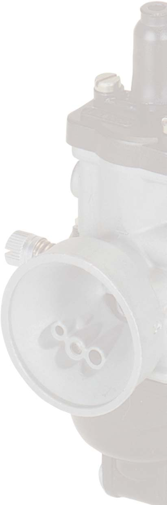
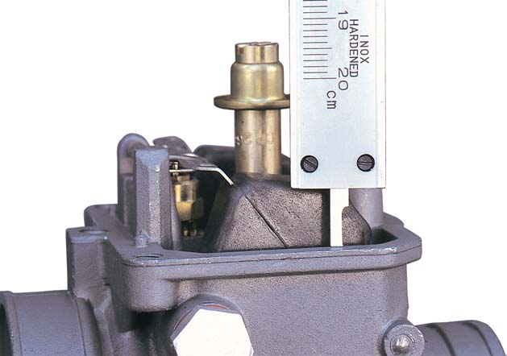
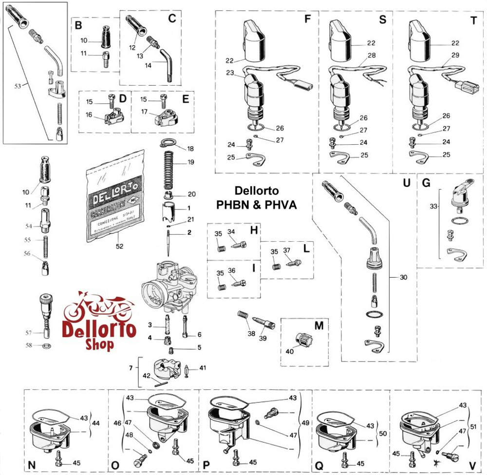
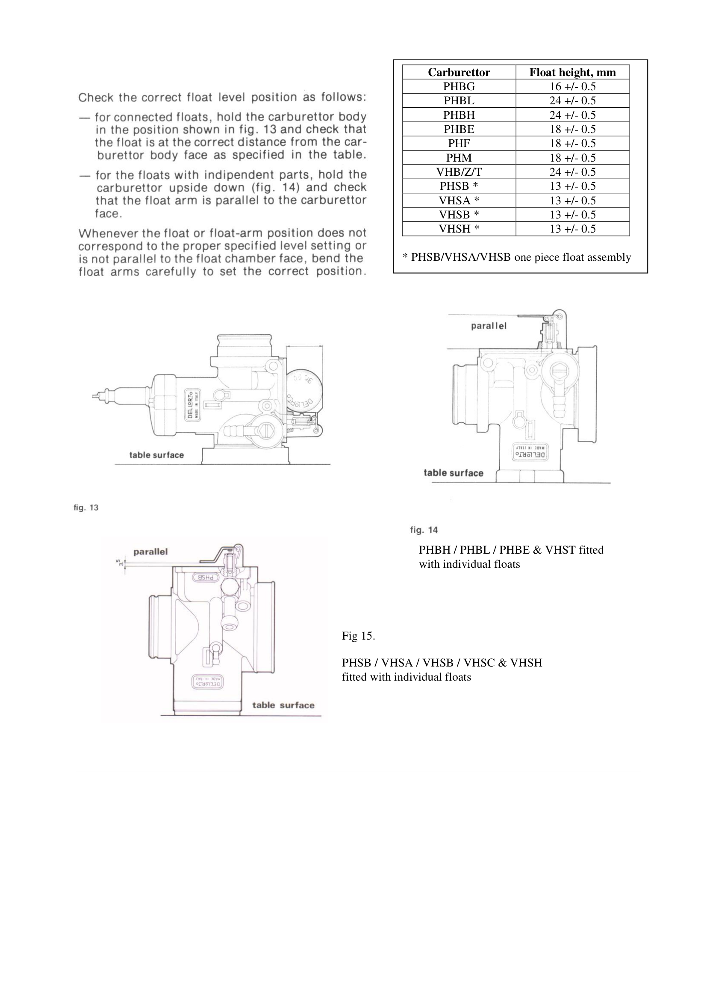
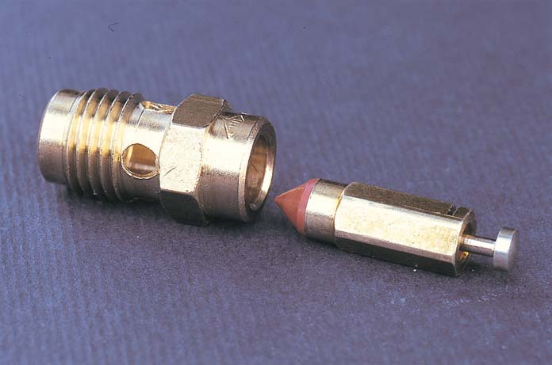
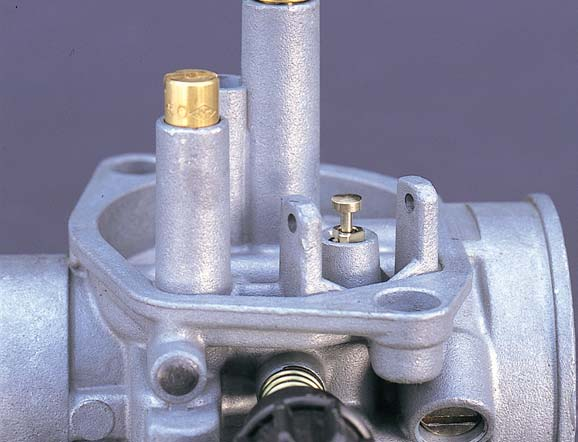

# Dell'Orto PHVA 14 – Forgasser

Standardforgasseren på alle EBS/EBE-drevne Derbi Senda (1995–2005) er **Dell'Orto PHVA 14 mm** iht. Derbi Euro 2 Workshop Manual. GPR 50 Racing bruker PHVA 17,5 mm.

> ⚠️ **Merk:** Mange nettkilder oppgir feilaktig PHVA 17,5 mm for Senda-modellene. Verkstedmanualen (s. 10–15) spesifiserer PHVA 14 med 14 mm diffusor for alle Senda Racer-, Xtreme- og DRD-varianter.

<figure markdown="span">
  { width="280" }
  { width="280" }
  <figcaption>Dell'Orto PHVA – front og bakside. <em>Kilde: Dell'Orto Tuning Manual</em></figcaption>
</figure>

{ width="400" }
*PHVA-serien er designet for småsylindrede motorer under 125 cc.*

---

## Montering og slangetilkoblinger

### Mekanisk innfesting

Forgasseren har en **24 mm hann-stuss** som presses inn i den fleksible innsugsgummien (manifolden) på motoren og strammes med en slangeklemme. På luftfiltersiden kobles gummislangen fra luftfilterboksen på en **35 mm stuss**.

### Gasswire og stempel (slide assembly)

1. Tre gasswiren gjennom topplokket, deretter gjennom returfjæren
2. Pass på at den flate siden av fjæren vender riktig vei
3. Trekk fjæren tilbake slik at wirenippelen kan festes ned i gass-stempelet
4. Nålen holdes av en liten låseplate – tappen på platen må treffe nøyaktig i sporet for å låse wiren
5. Sett topplokket på plass – utskjæringen (sporet) sikrer at det bare kan monteres i én retning

### Slangetilkoblinger

| Stuss | Beskrivelse | Kobles til |
|-------|-------------|------------|
| **Bensintilførsel** | Tykkeste stussen, vertikal | Slange fra bensinkran under tanken |
| **Vakuumslange** | Horisontal stuss | Automatisk bensinkran – åpner for bensin når motoren skaper undertrykk |
| **Oljepumpe** | Tynn messingnippel på siden | Slange fra motorens oljepumpe (autolube) |
| **Forgasservarme** | To stusser, ofte med U-formet slangebit | Kan kobles til kjølesystem på sylinderhodet for å forhindre ising |

> ⚠️ **Oljepumpe-nippelen er kritisk.** Hvis denne ikke kobles til, får motoren ingen smøring og vil raskt skjære seg. Kjører du med oljeblanding rett i tanken, må nippelen tettes helt for å unngå falsk luft.

> Forgasservarmestussene kan blendes med en kort slangebit (loop) dersom de ikke kobles til kjølesystemet.

{ width="500" }
*Drivstoffleveringssystem med nummererte komponenter. Kilde: Dell'Orto Tuning Manual*

{ width="350" }
*Hann-stuss med fleksibel gummikobling – tilsvarende PHVA sin 24 mm manifold-tilkobling.*

---

## Jetting per modell (iht. verkstedmanual)

Verdiene under er fra Derbi Euro 2 Workshop Manual (s. 10–15). «Racer» tilsvarer eldre Senda R/SM, «Xtreme» tilsvarer X-Trem/X-Race, «DRD» tilsvarer DRD-varianter.

| Parameter | Racer (s.10) | Xtreme (s.12) | DRD (s.14) | GPR 50 (s.16) |
|-----------|-------------|---------------|------------|---------------|
| Forgasser | PHVA 14 | PHVA 14 | PHVA 14 | PHVA 17,5 |
| Diffusor | 14 mm | 14 mm | 14 mm | 17,5 mm |
| Hoveddyse | #73 | #71 | #71 | #98 |
| Tomgangsdyse | #36 | #32 | #32 | #34 |
| Choke-dyse | #45 | #50 | #50 | #50 |
| Nål / posisjon | A8 / 3. hakk | A11 / 4. hakk | A11 / 4. hakk | A15 / 4. hakk |
| Gasslide | #30 | #30 | #30 | #40 |
| Emulgatorrør | #211GA | #211GA | #211GA | #212FA |
| Luftskrue | 3 svinger ut | 2¾ svinger ut | 2¾ svinger ut | 3 svinger ut |
| Flottørvekt | 3,5 g | 3,5 g | 3,5 g | 3,5 g |
| Tomgang | 1900 ±100 RPM | 1900 ±100 RPM | 1900 ±100 RPM | 1900 ±100 RPM |

> **Senda R 2004 (NL 3874)** er en Racer- eller Xtreme-variant → PHVA 14, hoveddyse #71–73, nål A8 eller A11.
> **Senda SM X-Trem 2005 (AU 7933)** er en Xtreme-variant → PHVA 14, hoveddyse #71, nål A11/4th.

## Justering steg for steg

### Tomgang
1. Skru inn luftskruen forsiktig helt inn
2. Skru den **2¾ omdreininger ut** som utgangspunkt (iht. verkstedmanual for Xtreme/DRD)
3. Start motoren og varm opp ~3 minutter
4. Juster tomgangsskruen til ~**1900 ±100 RPM**
5. Skru luftskruen langsomt inn/ut til høyeste stabile turtall
6. Sett tomgangsskruen tilbake til målverdi
7. Gasskabel fritt spill: **3–5 mm**

### Nålposisjon (1/4–3/4 gass)
A25-nålen har 5 klipsposisjoner:
- Klips nærmere spissen (nederst) → **rikere** blanding
- Klips nærmere flat-enden (øverst) → **magrere** blanding
- Juster ett hakk om gangen og prøvekjør

### Hoveddyse (3/4–full gass)
Gjør en «plug chop»: kjør i 3/4–full gass i ~30 sekunder, drep motoren med kill-switch under belastning, les tennpluggen:
- **Lys brun/beige** = korrekt
- **Hvit/lys** = for mager → større dyse (+2–3 numre)
- **Svart/våt** = for rik → mindre dyse (−2–3 numre)

### Flottør
- Maks flottørvekt: **3,5 gram** (bytt hvis tyngre)
- Nålventilstørrelse bør være ~30 % større enn hoveddysen

## Rengjøring
1. Demonter forsiktig (merk alle slanger)
2. Bruk forgasserrens spray på alle kanaler og dyser
3. Rens nålejett og hoveddyse med trykkluft – **aldri tynn ståltråd**
4. Sjekk flottørnivå og flottørnålstetting

## Dokumentasjon

| Dokument | Lenke |
|----------|-------|
| Dell'Orto offisiell tuning-manual (PDF) | https://www.dellorto.it/wp-content/uploads/2020/12/dellorto_manual.pdf |
| Dell'Orto PHBN/PHVA eksplodert diagram + deler | https://www.dellortoshop.com/contents/en-us/d22_Dellorto-PHBN-and-PHVA-Carburetor-Parts-Shop.html |
| Dell'Orto tuning guide (Ducati Meccanica) | https://www.ducatimeccanica.com/dellorto_guide/dellorto_3_4.html |
| Dell'Orto flottørnivå-tabell (PDF) | https://www.dellorto.co.uk/wp-content/uploads/2019/07/floatlevel.pdf |
| Dell'Orto Motorcycle Carburetor Tuning Guide (Scribd) | https://www.scribd.com/document/55146322/Dellorto-Motorcycle-Carburetor-Tuning-Guide |

## OEM eksplodert forgasserdiagram

{ width="500" }
*Eksplodert visning av Dell'Orto PHBN/PHVA-forgasser med nummererte deler.*

| Modell | Lenke |
|--------|-------|
| SM X-Race 50 E2 – Carburettor | [oemmotorparts.com](https://www.oemmotorparts.com/en/model/derbi/senda-50-sm-x-race-50-cc-euro2/2004/drawing/carburettor) |
| R X-Race E2 2004 – Carburettor | [motorcyclespareparts.eu](https://www.motorcyclespareparts.eu/en/derbi-parts/2004-senda-50-r-x-race-e2-motorcycles/carburettor) |

### Flottørnivå – Dell'Orto PHVA

Flottørnivået kontrollerer bensinnivået i forgasserkammeret og påvirker blanding ved alle gassposisjoner.

{ width="400" }
*Korrekt måleprosedyre for flottørnivå. Mål avstand A fra tetflate til flottørens høyeste punkt.*

{ width="500" }
*Komplett flottørnivåtabell for alle Dell'Orto-modeller. PHVA: ikke oppført direkte, bruk 18 ± 0,5 mm. Kilde: Dell'Orto Float Level PDF*

**Måleprosedyre:**
1. Demonter forgasserens bunnkar
2. Hold forgasseren opp ned (topplokket ned) slik at flottøren hviler på nålventilen uten å presse fjæren
3. Mål avstanden fra flottørens høyeste punkt til forgasserkroppens tetningsflate
4. Typisk mål: **18 ± 0,5 mm** (verifiser mot Dell'Orto flottørtabell)
5. Juster ved å bøye metallfliken som hviler mot nålventilen forsiktig

<figure markdown="span">
  { width="250" }
  { width="250" }
  <figcaption>Nålventil innfelt i forgasserkropp (venstre) og avtakbar variant med fjærbelastet nål (høyre).</figcaption>
</figure>

**Symptomer ved feil flottørnivå:**
- For høyt (for mye bensin): Motor renner over, svart tennplugg, bensinlukt
- For lavt (for lite bensin): Mager blanding ved gass, nøling, overoppheting

---

## Komplett forgasser-kryssreferanse (verkstedmanual s. 32)

Denne tabellen fra Derbi Euro 2 Workshop Manual dekker alle modeller som brukte Dell'Orto-forgassere.

??? note "Klikk for å utvide komplett jetting-tabell (38 modeller)"

    | Kjøretøy | Forgasser | Hoveddyse | Nål/pos. | Gasslide | Choke | Tomgangsdyse | Luftskrue | Emulgator | Flottør (g) |
    |----------|-----------|-----------|----------|----------|-------|-------------|-----------|-----------|-------------|
    | Senda R/SM 2000 (Spain/Fra) | PHVA 14DD | #71 | A11/4th | #30 | #45 | #32 | 2¾ | #211GA | 3,5 |
    | Senda R/SM 2000 (Italy) | PHVA 12DD | #65 | A11/4th | #30 | #45 | – | 2½ | #211GA | 3,5 |
    | Senda R 2000 (WVTA) | PHVA 14DD | #53 | A11/3rd | #40 | #50 | #33 | 1¾ | #208GA | 3,5 |
    | Gilera Zulu (WVTA) | PHVA 14DD | #54 | A11/3rd | #40 | #50 | #34 | 2±¼ | #208GA | 3,5 |
    | Senda R/Fenix (Spain) | PHVA 14DD | #73 | A8/3rd | #30 | #45 | #36 | 3 | #211GA | 3,5 |
    | Senda R (France) | PHVA 14DD | #60 | A11/3rd | #30 | #50 | #36 | 2½ | #210GA | 3,5 |
    | Senda R (Italy) | PHVA 12DD | #65 | A11/4th | #30 | #45 | #38 | 2½ | #211GA | 3,5 |
    | Senda R (Austria) | PHVA 14DD | #60 | A11/3rd | #40 | #50 | #38 | 2¼ | #208GA | 3,5 |
    | Senda R (Germany/95) | PHVA 14DD | #62 | A11/3rd | #40 | #50 | #34 | 2,5 | #208GA | 3,5 |
    | Senda R 100 (SouthAm.) | PHVA 17.5ED | #83 | A7/3rd | #40 | #50 | #34 | 2½ | #212FA | 3,5 |
    | Senda SM (Austria) | PHVA 14DD | #63 | A8/3rd | #30 | #45 | #36 | 3 | #211GA | 3,5 |
    | GPR 50 R (WVTA) | PHVA 17.5TS | #54 | A11/3rd | #30 | #45 | #34 | 3 | #208GA | 3,5 |
    | GPR 50 R (Spain) | PHVA 17.5ED | #98 | A15/4th | #40 | #50 | #34 | 3 | #212FA | 3,5 |
    | GPR 50 R (France) | PHVA 14DD | #70 | A11/3rd | #30 | #45 | #36 | 2½ | #208GA | 3,5 |
    | Bultaco Lobito (WVTA) | PHVA 14DD | #53 | A29/3rd | #40 | #50 | #33 | 1¾ | #212GA | 3,5 |

    *Kilde: Derbi Euro 2 Workshop Manual, side 32 (komprimert utdrag). Se verkstedmanualen for fullstendig tabell med alle 38 modeller.*

---

## Modellspesifikke forgasserdetaljer

- [Komplett justeringsguide (demontasje, rengjøring, jetting, plug chop)](tuning-guide.md)
- [Senda R 2004 – Forgasser](../models/senda-r-2004/README.md#6-forgasser--dellorto-phva-14)
- [Senda SM X-Trem 2005 – Forgasser](../models/senda-sm-xtrem-2005/README.md#6-forgasser--dellorto-phva-14)
