# Dell'Orto PHVA 17,5 mm – Komplett justeringsguide

> **Gjelder:** Derbi Senda R 2004 (NL 3874) · Senda SM X-Trem 2005 (AU 7933)  
> **Motor:** EBS050 / EBE050  
> **Forgasser:** Dell'Orto PHVA 17,5 mm (delenr. 06342)

---

## Innholdsfortegnelse

1. [Forgasserens anatomi](#1-forgasserens-anatomi)
2. [Verktøy og forbruksmateriell](#2-verktøy-og-forbruksmateriell)
3. [Demontasje – komplett prosedyre](#3-demontasje--komplett-prosedyre)
4. [Rengjøring og inspeksjon](#4-rengjøring-og-inspeksjon)
5. [Justeringspunkter – hva styrer hva](#5-justeringspunkter--hva-styrer-hva)
6. [Jetting-referanse per modell](#6-jetting-referanse-per-modell)
7. [Justering – steg for steg](#7-justering--steg-for-steg)
8. [Plug chop – les tennpluggen](#8-plug-chop--les-tennpluggen)
9. [Flottørnivå](#9-flottørnivå)
10. [Symptomdiagnose](#10-symptomdiagnose)
11. [Montering – komplett prosedyre](#11-montering--komplett-prosedyre)
12. [Etter montering – prøvekjøring](#12-etter-montering--prøvekjøring)
13. [Referanser](#13-referanser)

---

## 1. Forgasserens anatomi

PHVA 17,5 er en horisontal piston-slide-forgasser med mekanisk gass-stempel og automatisk choke (eller manuell choke på noen varianter). «17,5» refererer til venturi-diameteren i millimeter – tverrsnittsinnsnevringen som skaper undertrykket som trekker inn drivstoff.

### Komponentoversikt

```
FORGASSER – SETT OVENFRA
─────────────────────────────────────────────

  ┌──────────────┐
  │  Topplokk    │ ← Gasswire + returfjær + nål
  └──────┬───────┘
         │  Gass-stempel (slide)
         │  ┌──────┐
         │  │  Nål │ ← A13 / A25, 5 klipshakk
         │  └──────┘
  ┌──────┴───────────────────────────────┐
  │         Forgasserkropp               │
  │                                      │
  │  Luftskrue ──►●    Tomgangsskrue ──►●│
  │                                      │
  │         [Bensinkammer]               │
  │    ┌──────────────────────┐          │
  │    │     Flottør (2 stk)  │          │
  │    │   [Nålventil 1,5 mm] │          │
  │    └──────────────────────┘          │
  │                                      │
  │  ●── Tomgangsdyse (pilot jet)        │
  │  ●── Hoveddyse (main jet)            │
  │  ●── Nålejett (needle jet)           │
  └──────────────────────────────────────┘
         │
  ┌──────┴───────┐
  │   Bunnkar    │ ← Kan demonteres separat
  └──────────────┘

STUSSER (sett fra siden):
  ← Luftfilter (35 mm)    Motor (24 mm) →
  ↓ Bensin (fra kran)
  ↓ Vakuum (til bensinkran)
  ↓ Olje (fra oljepumpe / autolube)
  ↓ Forgasservarme (fra kjølesystem, kan loopes)
  ↓ Overløp (bensinslange ned mot bakken)
```

### Funksjonsprinsipp

Gass-stempelet beveger seg vertikalt i forgasserkroppen styrt av gasswiren. Når stempelet heves, øker luftstrøm og undertrykk ved nålejettet, som trekker opp bensin fra kammeret. Blandingsforholdet styres av fem separate systemer som overlapper hverandre:

| System | Aktiv gasspenn | Styres av |
|--------|---------------|-----------|
| Startanriking (choke) | Kaldstart | Choke-spak / automatisk |
| Tomgangsystem | 0–1/8 gass | Tomgangsdyse + luftskrue |
| Overgangsystem | 1/8–1/4 gass | Tomgangsdyse + nålspiss |
| Mellomregister | 1/4–3/4 gass | Nålposisjon (klipshakk) |
| Fullgass-system | 3/4–full gass | Hoveddyse |

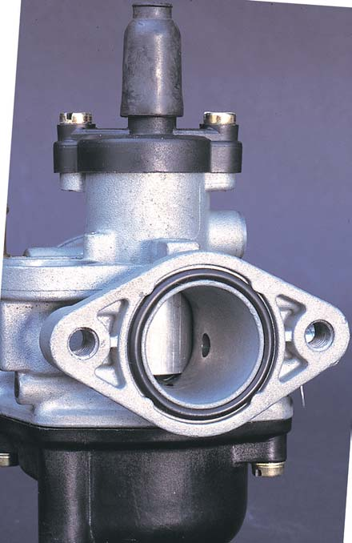{ width="350" }
*PHVA er en «piston-slide»-forgasser med rundt gass-stempel som beveger seg vertikalt. Stempelets posisjon bestemmer luftstrømmen gjennom venturien.*

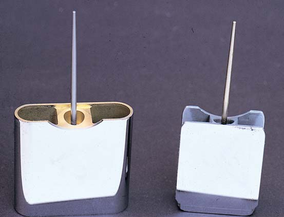{ width="350" }
*Avfasingen på gass-stempelets underkant påvirker blandingen i overgangssonen. Avfasingen skaper en kontrollert luftstrøm over progresjonshullene ved lav stempelåpning.*

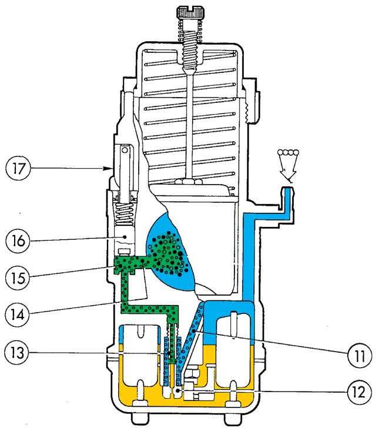{ width="400" }
*Starterkretsen (choke) har sin egen separate drivstoff- og luftbane med startdyse. På EBS/EBE brukes enten manuell eller automatisk choke.*

Ingen av disse systemene er helt isolert – endringer i ett system påvirker naboregionene. Juster alltid ett punkt om gangen og prøvekjør mellom hver endring.

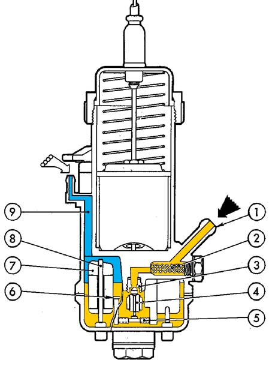{ width="500" }
*Komplett tverrsnitt som viser alle forgasserkretser: flottørkammer, tomgangskrets, hovedkrets og startanrikning. Kilde: Dell'Orto Tuning Manual*

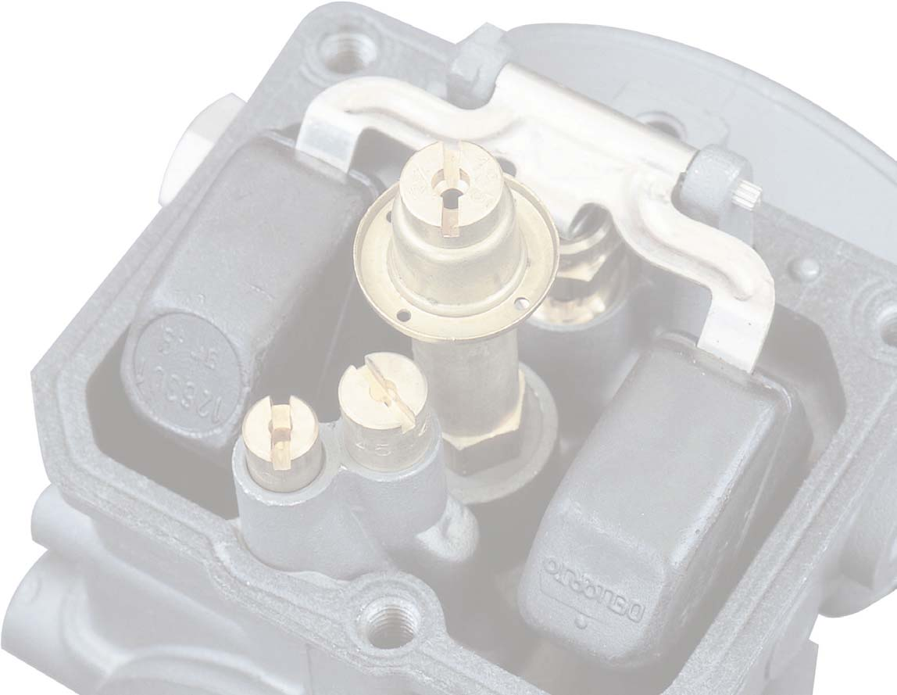{ width="500" }
*Kalibreringselementene i en Dell'Orto-forgasser: (A) Hoveddyse, (B) Nålejett/atomiser, (C) Konisk nål, (D) Gass-stempel, (E) Tomgangsdyse, (F) Luftskrue, (G) Startdyse. Disse komponentene styrer blandingsforholdet ved ulike gassposisjoner.*

---

## 2. Verktøy og forbruksmateriell

### Nødvendig verktøy

| Verktøy | Spesifikasjon | Bruk |
|---------|--------------|------|
| Flatskrutrekker | Medium blad | Tomgangsskrue, luftskrue, bunnkar |
| Flatskrutrekker | Liten / smal | Hoveddyse, tomgangsdyse (slisset) |
| Stiftskrutrekker | Ø 3–4 mm | Luftskrue (sitter dypt) |
| Kombiskrutrekker | PH2 | Topplokk-skruer |
| Slangeklemme-tang | – | Slangeklemmer |
| Digitalt turtallsmåler | Kontaktløs induktiv | RPM-måling ved tomgangsjustering |
| Multimeter | Valgfri | Kan utelates for grunnleggende justering |
| Plastkluter / papir | – | Underlag og absorpsjon |

> **Turtallsmåler:** Svært anbefalt. Uten måler justerer du på lyd og feel alene – som fungerer, men er upresist, særlig for tomgangsjustering. En induktiv clip-on-teller (Koso, Trail Tech) koster 200–400 kr og lønner seg.

### Forbruksmateriell

- Forgasserrens (spray, f.eks. Würth, Liqui Moly)
- Trykkluft (kompressor eller boks)
- Bensin (rent) til skylling
- O-ring-sett PHVA 17,5 (Dell'Orto PHVA overhalingssett)
- Evt. nye dyser (se jetting-tabell i §6)
- WD-40 / lettflytende olje til kabler

### Hva du *ikke* skal bruke

- **Aldri tynn ståltråd, nagler eller spikerblad** til å stikke gjennom dyser – det ødelegger de presisjonsbores kanalene permanent.
- **Aldri høytrykksspyler** direkte på forgasseren.
- **Aldri skruekrekker til dyser** – alle dyser er av myk messing og ødelegges lett av feil verktøystørrelse eller for mye kraft.

---

## 3. Demontasje – komplett prosedyre

> ⚠️ Steng alltid bensinkranen (til «OFF» eller «PRI» for tømmming) før du begynner.

### 3.1 Frigjør luftfiltersiden

1. Løsne slangeklemmen som holder luftfilterboksen mot forgasserens 35 mm-stuss.
2. Trekk luftfilterboksen bakover og legg den til side. Den trenger ikke demonteres helt.

### 3.2 Koble fra gasswire

1. Finn justeringsskruen på gasswiren nær styret (typisk på høyre side av styrehåndtaket).
2. Skru justeringsskruen inn for å gi mest mulig slakk i wiren.
3. På topplokket til forgasseren: skru av den runde dekselskruen (eller klem sammen og drei, avhengig av variant).
4. Løft opp gass-stempel med returfjær og nål som én enhet.
5. Frigjør wirenippelen fra stempelet ved å vinkle stempelet slik at nippelen kan glide ut av sporet.
6. Legg stempel/fjær/nål trygt til side – ikke mist klipset fra nålen.

<figure markdown="span">
  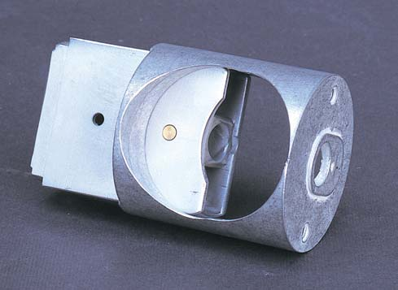{ width="250" }
  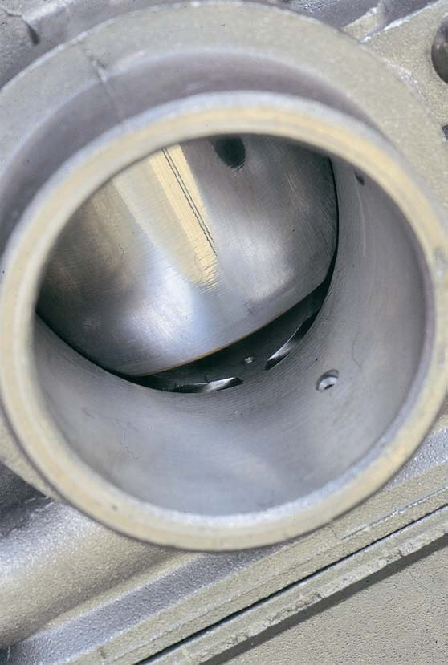{ width="250" }
  <figcaption>Venstre: Fjærenhet og gassspjeld demontert. Høyre: Innside av sylindrisk gass-stempel med nål-spor og wirefeste.</figcaption>
</figure>

### 3.3 Koble fra choke-wire (hvis manuell choke)

Løsne låsemutteren på choke-wiren og koble den fri fra choke-spaken på forgasserkroppen.

### 3.4 Koble fra slanger

Koble fra i denne rekkefølgen – ha en plastklut klar under hver:

| Slange | Plassering | Merknad |
|--------|-----------|---------|
| **Bensinslange** | Bunnpart av forgasser | Ha klut klar – rennende bensin |
| **Vakuumslange** | Side av forgasser | Liten, tynn – lett å glemme |
| **Oljepumpe-slange** | Messingnippel på side | Forsegles hvis premix brukes |
| **Forgasservarme** | To stusser, U-slangebit | Kan forbli koblet til og trekkes med |
| **Overløpsslange** | Under bunnkar | Bare løsne ved behov |

> **Merk slangene** med tape og tusj (B, V, O, F) hvis du er usikker på tilbakemontering. Feil tilkobling gir enten ingen bensin, falsk luft, eller smøringsvikt.

### 3.5 Løsne manifestkoblingen

1. Finn slangeklemmen mellom forgasserens 24 mm-stuss og innsugsgummien på motoren.
2. Løsne klemmen med flatskrutrekker.
3. Vri forgasseren forsiktig og trekk den rett ut. Innsugsgummien er stiv og det krever litt kraft.

Forgasseren er nå helt fri.

---

## 4. Rengjøring og inspeksjon

### 4.1 Ekstern rengjøring

Spray forgasserrens på utsiden og tørk av med klut. Fjern alle synlige avleiringer rundt slangestussene og justeringsskruene.

### 4.2 Demonter bunnkaret

1. Skru ut de to (eller fire) skruene under forgasserkroppen.
2. Trekk bunnkaret rett ned. Det sitter en O-ring i sporet – ta vare på den.
3. Flottøren og nålventilen er nå eksponert.

### 4.3 Demonter flottør og nålventil

1. Trekk ut flottørakselen (en liten stifttapp) fra siden av forgasserkroppen.
2. Løft ut flottøren forsiktig – den er to plastskåler bundet til aksel.
3. Nålventilen (1,5 mm messing-nål med gummispiss) faller gjerne ut med flottøren – legg den trygt til side.
4. Sjekk flottørene: vei dem. Maks vekt **3,5 gram** per flottørkropp. Tyngre betyr at det har trengt inn bensin → kast og bytt. Bøy flottørarmene lett for å se om de er deformerte.

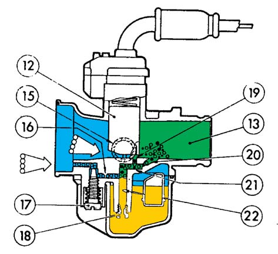{ width="380" }
*Tverrsnitt av flottørkammeret: Flottøren (1) styrer nålventilen (2) som regulerer drivstofftilførselen fra bensinslangen. Når nivået stiger, løfter flottøren nålventilen og stopper tilførselen.*

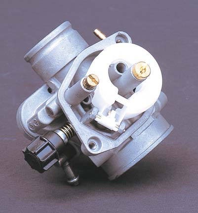{ width="350" }
*Ringformet (annulær) flottørdesign brukt på noen Dell'Orto-modeller. PHVA bruker dobbel flottør med sentral nålventil.*

### 4.4 Demonter dyser

| Dyse | Plassering | Verktøy |
|------|-----------|---------|
| **Hoveddyse** | Midten av forgasserkroppen, sitter skruegjengede inn i nålejettet | Liten flatskrutrekker |
| **Nålejett** | Rundt hoveddysen – trekkes rett ut etter at hoveddysen er fjernet | Trekkes ut for hånd |
| **Tomgangsdyse** | Siden av forgasserkroppen, liten slisset skrue | Liten flatskrutrekker |

> Skru ut dysene forsiktig og legg dem i rekkefølge. Blås gjennom hvert hull med trykkluft og hold dem opp mot lyset – et rent hull er et jevnt lysende punkt, et blokkert hull er ujevnt eller mørkt.

<figure markdown="span">
  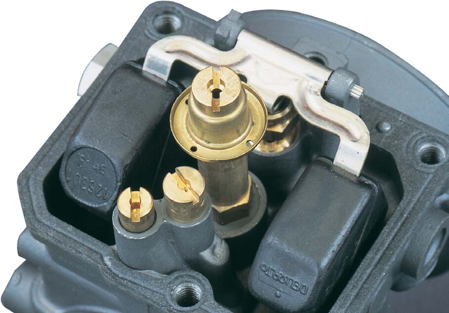{ width="300" }
  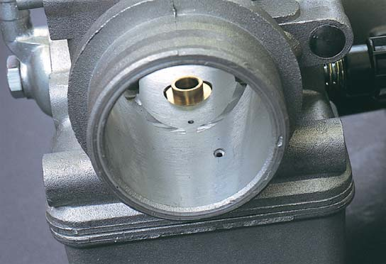{ width="220" }
  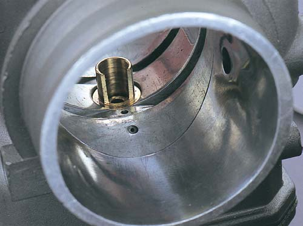{ width="220" }
  <figcaption>Venstre: Hoveddyse med baffel i flottørkammer. Midten og høyre: Tomgangsdyse i emulsjonstube og eksternt montert.</figcaption>
</figure>

### 4.5 Luftskrue

Luftskruen sitter dypt inne i forgasserkroppen og er beskyttet av en liten gummiplugg (på mange Euro 2-modeller). 

1. Stikk en smal stiftskrutrekker inn og skru forsiktig inn til du kjenner motstand.
2. Tell nøyaktig antall omdreininger – skriv det ned. Dette er utgangspunktet ditt.
3. Skru den helt inn (forsiktig – ikke stram) og skru den ut igjen med ditt noterte antall.

> Ikke skru luftskruen hardt inn – gummispissen deformeres og tetner ikke lenger korrekt.

<figure markdown="span">
  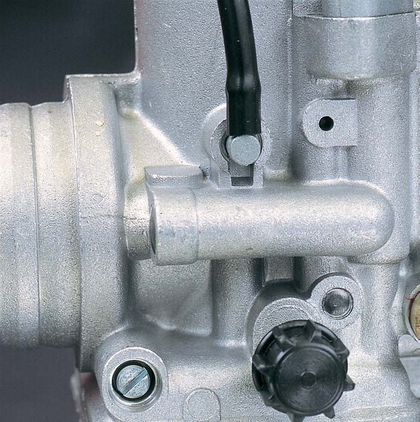{ width="250" }
  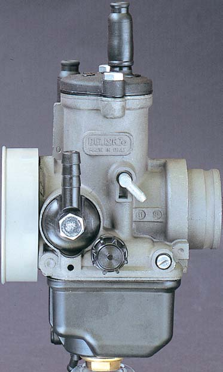{ width="250" }
  <figcaption>Luftskrue (venstre) sitter på luftfiltersiden og regulerer luft inn i tomgangskretsen. Blandingsskrue (høyre) sitter på motorsiden – PHVA bruker luftskrue.</figcaption>
</figure>

### 4.6 Rengjøring av alle kanaler

Spray forgasserrens gjennom hvert hull og kanal i forgasserkroppen. Bruk trykkluft til å blåse dem rene etterpå. Gjenta til rensen kommer ut ren.

Kritiske kanaler å sjekke:
- Hoveddyse-kanal (loddrett gjennom midten)
- Tomgangssystem-kanal (horisontal, kobler luftskrue og tomgangsdyse)
- Overgangskanal (liten kanal like under gass-stempelets laveste posisjon)
- Luftskrue-kanal

### 4.7 Sjekk gass-stempel og nål

1. Gass-stempelet skal gli jevnt i cylinderboringen uten hakking. Blås rent og smør lett med motorolje på utsiden.
2. Nålen skal ikke ha synlige slitasjemerker eller hakk. En skadet nål gir uforutsigbar blanding i mellomregisteret.
3. Sjekk at klipset sitter i riktig hakk (se §7.2).

### 4.8 Inspeksjon av innsugsgummi (manifold)

Undersøk den fleksible innsugsgummien på motoren. Se etter:
- Sprekker eller rifter, særlig nær klemmen
- Hardhet og sprøhet (gummi som er gammel og tørr)
- Deformasjon som gir falsk luft ved manifoldkoblingen

En sprukket manifold gir kontinuerlig falsk luft og kan ikke kompenseres med forgasserjustering alene.

---

## 5. Justeringspunkter – hva styrer hva

### 5.1 Luftskrue (blandingsskrue)

Luftskruen sitter på motorsiden av forgasserkroppen og regulerer mengden luft som blandes inn i tomgangssystemet. Den påvirker **kun tomgang og overgangssone** (0–1/4 gass).

- **Skru inn (med klokken):** Rikere blanding (mindre luft)
- **Skru ut (mot klokken):** Magrere blanding (mer luft)
- Typisk innstilling: **1,5–2,5 omdreininger ut** fra lett innskrudd

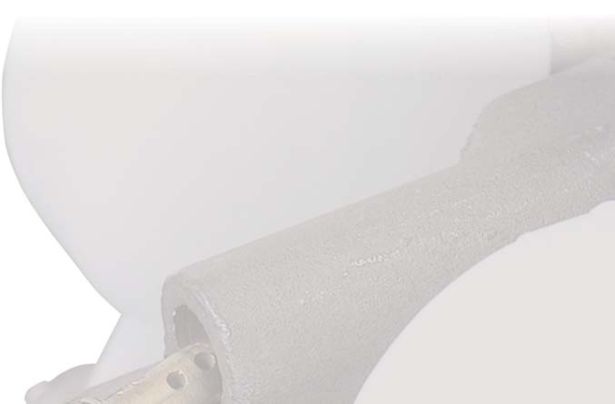{ width="450" }
*Tverrsnitt som viser luftskruens posisjon i forgasserkroppen og hvordan den regulerer lufttilførselen til tomgangskretsen.*

<figure markdown="span">
  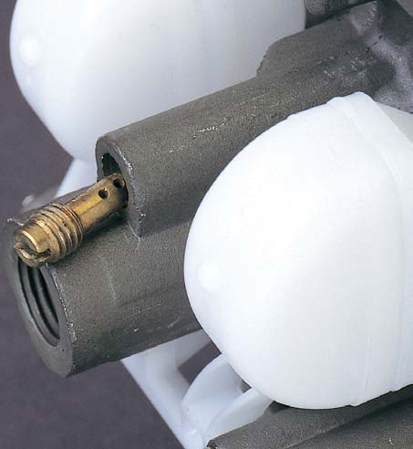{ width="280" }
  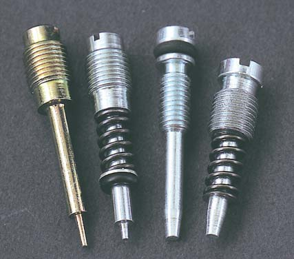{ width="250" }
  <figcaption>Forskjellen mellom luftskrue (venstre) og blandingsskrue (høyre). PHVA bruker luftskrue på motorsiden.</figcaption>
</figure>

### 5.2 Tomgangsskrue (gasskabelskrue)

Kontrollerer gass-stempelets minimale åpning og dermed tomgangs-RPM. Dette er *ikke* en blandings-skrue – den styrer bare turtallet.

- **Skru inn:** Høyere tomgangs-RPM
- **Skru ut:** Lavere tomgangs-RPM
- Mål: **1600–2000 RPM** på varm motor

### 5.3 Nålposisjon (klipshakk)

Nålen har 5 hakk for klipset. Klipset holder nålen i rett posisjon i stempelet. Når stempelet heves, heves også nålen og åpner gradvis for mer bensin gjennom nålejettet.

```
Nål (sett fra siden):

Flat ende (øverst)
    ──────────
    │  Hakk 1  │ ← Klips her = nål høyest = MAGRERE
    │  Hakk 2  │
    │  Hakk 3  │ ← Midten (fabrikkstandard)
    │  Hakk 4  │
    │  Hakk 5  │ ← Klips her = nål lavest = RIKERE
    ──────────
Spiss (nederst)
```

- **Klips opp (mot flat ende):** Nålen senkes i jettet → blokkerer mer drivstoff → **magrere** i mellomregisteret
- **Klips ned (mot spissen):** Nålen heves i jettet → slipper gjennom mer drivstoff → **rikere** i mellomregisteret
- Aktiv sone: **1/4 til 3/4 gass**

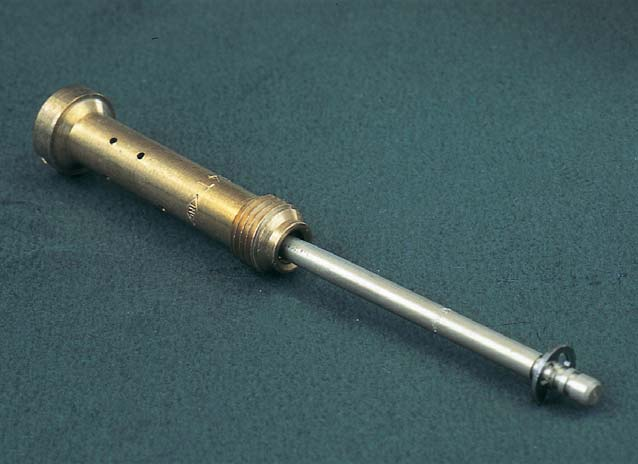{ width="400" }
*Konisk nål i nålejettet (atomiser). Når stempelet heves, heves nålen og frigjorde tverrsnittsåpningen for drivstoff øker gradvis. Klipsposisjonen bestemmer nålens basisposisjon.*

<figure markdown="span">
  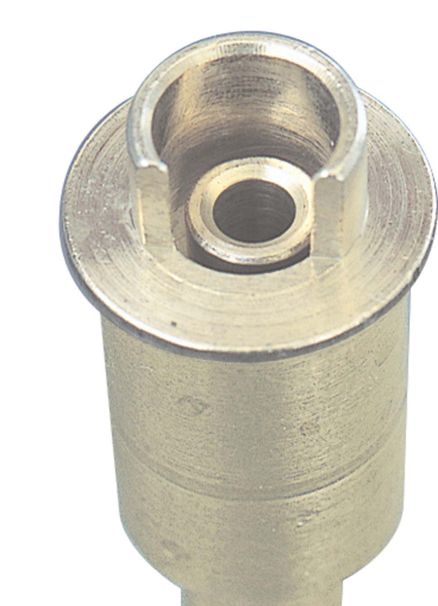{ width="280" }
  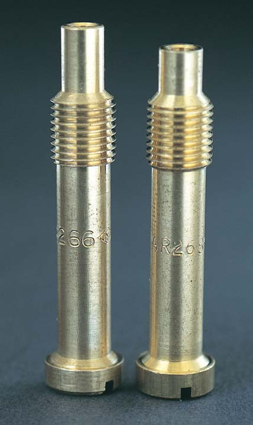{ width="220" }
  <figcaption>2-takt atomiser/nålejett-varianter (venstre) og steg-konfigurasjoner (høyre). Nålejettets indre profil påvirker drivstoffleveransen i mellomregisteret.</figcaption>
</figure>

### 5.4 Hoveddyse

Messingdyse med en kalibrert boreåpning. Dysenummeret er diameteren i hundredels millimeter – dyse 85 = Ø 0,85 mm.

- **Større dysenummer:** Rikere blanding ved fullgass
- **Mindre dysenummer:** Magrere blanding ved fullgass
- Aktiv sone: **3/4 til full gass**

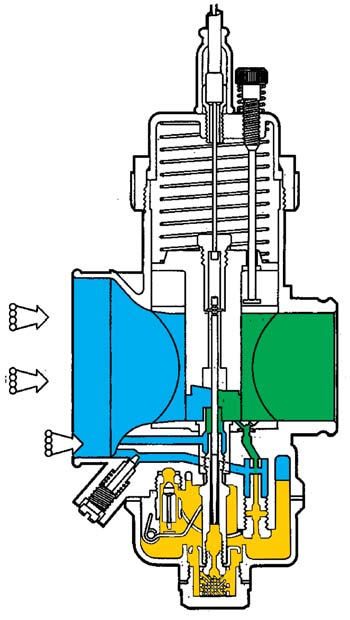{ width="350" }
*Hovedkretsen ved fullt gass (WOT). Drivstoff trekkes gjennom hoveddysen og atomiseres i nålejettet til venturistrømmen.*

### 5.5 Tomgangsdyse (pilot jet)

Styrer blandingen ved tomgang. På EBS/EBE med PHVA 17,5 er fabrikkstandard 30 og denne sjelden behøver endring med mindre motoren er vesentlig modifisert.

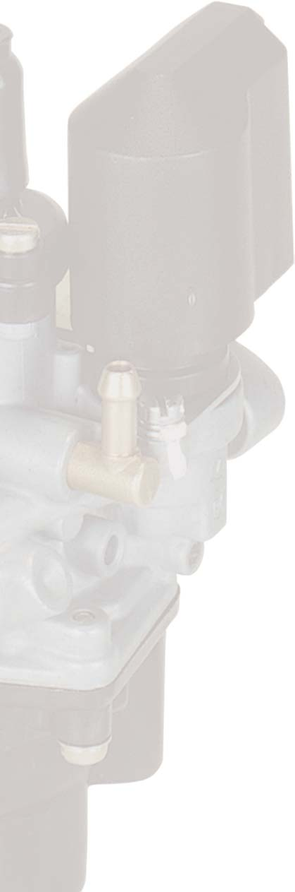{ width="400" }
*Oversikt over tomgangskretsen: drivstoff trekkes gjennom tomgangsdysen, blandes med luft fra luftskruen, og leveres via progresjonshullene under gass-stempelet.*

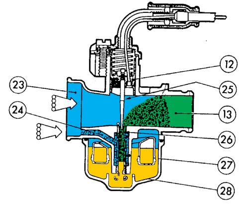{ width="350" }
*Tverrsnitt av tomgangskrets med tomgangsdyse, luftskrue og utgangshull.*

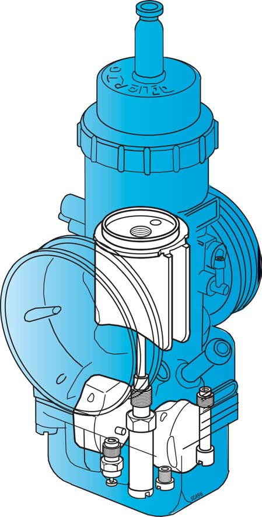{ width="350" }
*Nærbilde av progresjonshullene (overgangsportene) under gass-stempelet. Disse hullene gir gradvis økende drivstofftilførsel i overgangssonen (1/8–1/4 gass).*

### 5.6 Flottørnivå

Kontrollerer bensinnivået i forgasserkammeret. Et for lavt nivå gir mager blanding ved alle gassposisjoner (kammeret tømmes raskere enn det fylles). For høyt nivå gir rik blanding og bensin kan renne over.

---

## 6. Jetting-referanse per modell

### Standard fabrikkinnstilling (EBS/EBE – PHVA 17,5)

| Parameter | Senda R 2004 restriktet | Senda R 2004 ubegrenset | Senda SM 2005 restriktet | Senda SM 2005 ubegrenset |
|-----------|------------------------|------------------------|------------------------|------------------------|
| Hoveddyse | 74 (noen: 72–75) | 85 | 62 (noen: 70–75) | 85 |
| Tomgangsdyse | 30 (noen: 34–36) | 30 | 30 (noen: 34) | 30 |
| Choke-dyse | — | — | 50 | 50 |
| Nåltype | A13 | A13 | A25 (noen: A13) | A25 |
| Nålposisjon | Hakk 3 (midten) | Hakk 2 | Hakk 3 (midten) | Hakk 2 |
| Diffuser | — | — | 208 GA | 208 GA |
| Luftskrue | 1,5–2,5 svinger ut | 1,5–2,5 svinger ut | 1,5–2 svinger ut | 1,5–2 svinger ut |
| Nålventil | 1,5 mm | 1,5 mm | 1,5 mm | 1,5 mm |

### Justeringsretning ved tuning

| Endring på motor | Juster forgasser slik |
|-----------------|----------------------|
| Fjernet luftboksrestriktor | Større hoveddyse (+3–5), rikere nål (ett hakk ned) |
| Lagt på sportseksosrør | Større hoveddyse (+5–10), mulig rikere nål |
| 70cc sylindersett | Hoveddyse 90–100, nål hakk 2–3, større forgasser anbefalt |
| Høyere høyde over havet (>500 m) | Magrere alt – 2 hakk ned pr. 1000 m |
| Kaldt vær (<5°C) | Rikere – en størrelse større hoveddyse |
| Varmt vær (>30°C) | Magrere – en størrelse mindre hoveddyse |

> **Husk:** Jus alltid ett punkt om gangen. Endre ikke hoveddyse og nål samtidig – da vet du ikke hva som virker.

---

## 7. Justering – steg for steg

Denne prosedyren forutsetter at forgasseren er ren og korrekt montert.

### 7.1 Tomgangssystem

**Forutsetning:** Varm motor (minst 5 minutters kjøring eller 3 min varming på stand).

**Steg 1 – Luftskrue-nullstilling:**
1. Skru luftskruen forsiktig inn til den akkurat berører setet – IKKE stram.
2. Skru den ut **1,5 omdreininger** som startpunkt.

**Steg 2 – Sett tomgang:**
1. Start motoren.
2. Juster tomgangsskruen (stopp-skruen) til RPM er stabilt rundt **1800 RPM**. Bruk RPM-måler.

**Steg 3 – Finn rikeste punkt med luftskruen:**
1. Skru luftskruen sakte **ut** (mot klokken), en kvart omdreining om gangen.
2. Vent 5–10 sekunder mellom hvert steg – motoren tar tid på å respondere.
3. Turtallet vil stige etter hvert som blandingen optimaliseres.
4. Fortsett til turtallet begynner å falle igjen. Det høyeste punktet er optimal luftskrue-posisjon.
5. Skru luftskruen tilbake til det punktet der turtallet var høyest.

**Steg 4 – Korriger tomgang:**
1. Turtallet er nå sannsynligvis høyere enn 1800 RPM etter luftskrue-optimaliseringen.
2. Skru tomgangsskruen tilbake til 1600–2000 RPM.

**Steg 5 – Verifiser gassgjenging:**
1. Gi gass skarpt og slipp – tomgangen skal returnere stabilt innen 1–2 sekunder.
2. Hvis motoren dør ved gassreduks: tomgangen er for lav, eller luftskruen er for mager.
3. Hvis motoren ruser i mer enn 2 sekunder: gasswire er for stramt justert (3–5 mm fri-slagg).

**Steg 6 – Sjekk gasskabel-fri-slagg:**
1. Med motoren på tomgang, steer styret fra side til side.
2. Turtallet skal ikke endre seg. Hvis det stiger: gasswiren er for stramt justert.
3. Korriger ved justeringsskruen ved styrehåndtaket.

---

### 7.2 Mellomregister (nålposisjon)

Kjør motoren til arbeidstemperatur. Prøvekjør i **1/4 til 3/4 gass** – typisk 30–60 km/t på flat vei.

**Symptomer og tiltak:**

| Symptom | Diagnose | Tiltak |
|---------|---------|--------|
| Motor hakker/nøler i overgangssone, særlig fra lav til middels gass | For mager | Flytt klips ett hakk ned (mot spissen) → nålen heves → rikere |
| Motor ruser seg og virker «dunkel» i mellomregisteret | For rik | Flytt klips ett hakk opp (mot flat ende) → nålen senkes → magrere |
| Motor akselererer jevnt og lineært gjennom registeret | Korrekt | La det stå |

**Prosedyre for å flytte klips:**
1. Demonter forgasserens topplokk (2–3 skruer).
2. Trekk opp gass-stempel med nål.
3. Press klipset til side med en liten flatskrutrekker og trekk det av.
4. Sett klipset i nytt hakk.
5. Monter og prøvekjør.

> Klipset er lite og kan hoppe avgårde. Arbeid over en boks eller med en klut under.

---

### 7.3 Fullgass-sone (hoveddyse)

Hoveddysen justeres på grunnlag av plug chop (se §8) eller symptomer ved fullgass-kjøring.

**Symptomer:**

| Symptom ved 3/4–full gass | Diagnose | Tiltak |
|--------------------------|---------|--------|
| Motor mister kraft, «bogging», kutter | For mager hoveddyse | Større dyse (+2 til +5) |
| Motor akselererer rent, jevn kraft | Korrekt | La det stå |
| Svart, oljeaktig eksosrøyk ved fullgass | For rik | Mindre dyse (−2 til −3) |
| Motor yter best med choke halvveis på | Definitivt for mager | Større dyse |

**Bytte hoveddyse:**
1. Steng bensinkranen.
2. Skru av bunnkaret (2–4 skruer under forgasserkroppen).
3. Skru ut hoveddysen med en liten flatskrutrekker – merk nummeret (det er preget på siden).
4. Skru inn ny dyse. Ikke stram mer enn fingertett + en kvart omdreining.
5. Monter bunnkar med ny eller rengjort O-ring.

---

## 8. Plug chop – les tennpluggen

Plug chop er den mest pålitelige metoden for å vurdere blandingsforholdet ved fullgass, da tennpluggens farge reflekterer forbrenningstemperaturen direkte.

### Forberedelse

- Start med en **ny tennplugg** (NGK BR9ES).
- Pluggen må være hvit (ny) og uten tidligere avleiringer.
- Kjør til arbeidstemperatur.

### Prosedyre

1. Finn en rolig vei eller en parkeringsplass med god plass.
2. Akselerere til **full gass** i 3. eller 4. gir.
3. Hold full gass i **20–30 sekunder**. Dette er nødvendig for at avleiringen skal «brenne fast».
4. Trykk kill-switch (ikke slipp gassen) og let sykkelen rulle til stopp. **Ikke reduser gassen – dette er kritisk.** Gassreduksjon endrer blandings-avleiringen i pluggen.
5. Demonter tennpluggen umiddelbart.
6. Les pluggen i dagslys.

### Tolkningsguide

```
TENNPLUGG-LESING

MAGER                    KORREKT                   RIK
────────────────────────────────────────────────────────────
  ┌────┐                   ┌────┐                   ┌────┐
  │    │ Hvit / grå        │    │ Lys brun / tan    │    │ Svart / sotet
  │    │ Isolatorspiss     │    │ Isolatorspiss      │    │ Isolatorspiss
  │    │ er hvit,          │    │ er lys brun.       │    │ er svart
  │    │ tørr,             │    │ Elektroden tørr.   │    │ med sot.
  └────┘ kanskje           └────┘ Liten grå          └────┘ Elektroden
         litt brent.              ring ved                  kan ha
                                  isolatorfoten.            «brent» grå
                                                            rundt randen.

TILTAK:                   TILTAK:                   TILTAK:
Større hoveddyse          Ingenting                 Mindre hoveddyse
(+3–5 numre).             La det stå.               (−2–3 numre).
Sjekk også nål
og luftlekkasje.
────────────────────────────────────────────────────────────
```

### Viktige detaljer

- **Svart og oljeaktig (ikke bare sotet):** Tyder på oljebrenning – sjekk smøreblandingsforhold, ikke bare hoveddyse.
- **Hvit med smeltet elektrode:** Alvorlig mager – motoren er i fare. Sjekk umiddelbart for luftlekkasjer, feil dyse, eller utilstrekkelig kjøling.
- **Brun men med hvit ring øverst på isolatoren:** Akseptabelt for daglig bruk, men litt på mager side.
- Gjenta alltid plug chop to ganger for å bekrefte – én kjøring kan gi misvisende resultat.

---

## 9. Flottørnivå

### Funksjon

Flottøren regulerer bensinnivået i forgasserkammeret via nålventilen. Nivået påvirker blandingen ved **alle gassposisjoner** – et feil flottørnivå kan ikke kompenseres med justeringer av dyser eller luftskrue alene.

### Måleprosedyre

1. Demonter bunnkaret (se §4.2).
2. Hold forgasseren **opp ned** – topplokket skal peke ned.
3. La flottøren hvile mot nålventilen under **egen tyngde**. Ikke press flottøren ned – nålventilen skal nettopp akkurat lukke.
4. Mål avstanden fra flottørens høyeste punkt til forgasserkroppens tetningsflate (der O-ringen sitter).

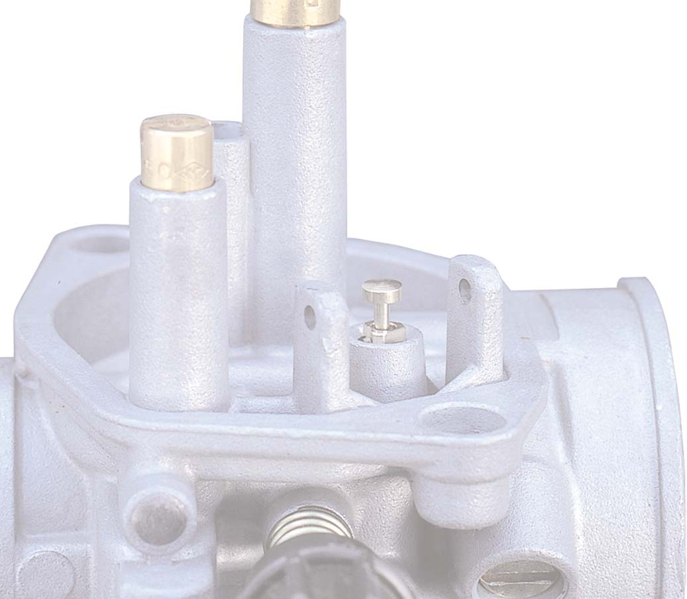{ width="400" }
*Korrekt måleprosedyre: Hold forgasseren opp ned og mål avstand A fra tetflate til flottørens høyeste punkt. Mål: 18 ± 0,5 mm.*

**Målemål:**

| Parameter | Verdi |
|-----------|-------|
| Mål A (flottørhøyde, PHVA 17,5) | **18 ± 0,5 mm** |
| Maks tillatt avvik | ±1 mm |

```
Forgasserkropp (holdt opp ned):

    ┌──────────────────┐
    │   Tetningsflate  │  ← Mål fra her
    └────────┬─────────┘
             │ 18 mm
    ─────────┼─────────
    ┌────────┴─────────┐
    │    Flottør       │  ← Til her (høyeste punkt)
    └──────────────────┘
```

### Justering

Flottørhøyden justeres ved å **bøye metallfliken** (braketten) som trykker mot nålventilen.

- **Bøy fliken mot forgasserkroppen:** Flottøren heves → **lavere** bensinnivå → magrere
- **Bøy fliken vekk fra forgasserkroppen:** Flottøren senkes → **høyere** bensinnivå → rikere

Bøy forsiktig med fingrene eller en flat tannstokk. Unngå tang – metallet er mykt og brytes lett.

### Symptomer ved feil flottørnivå

| Symptom | Diagnose | Tiltak |
|---------|---------|--------|
| Sterk bensinlukt, sort plugg, oversvømmelse | For høyt bensinnivå (flottøren for lav) | Bøy fliken ned (hev flottøren) |
| Mager ved alle gassposisjoner, overoppheting | For lavt bensinnivå (flottøren for høy) | Bøy fliken opp (senk flottøren) |
| Motor dør ved fullgass etter ~30 sek kjøring | Kammeret tømmes – bensinnivå for lavt | Bøy fliken opp |
| Motor ruser seg ved gassreduksjon | Bensinnivå for høyt | Bøy fliken ned |

---

## 10. Symptomdiagnose

Bruk denne tabellen til å identifisere problemet før du begynner å justere.

| Symptom | Gasspenn | Sannsynlig årsak | Sjekk/tiltak |
|---------|---------|-----------------|-------------|
| Motor starter ikke | – | Ingen drivstoff | Sjekk bensinkran, bensinslange, bunnkar |
| Motor starter, dør straks | Tomgang | Blokkert tomgangsdyse | Rens tomgangsdyse og -kanal |
| Ujevn tomgang, «puts og stopper» | Tomgang | For mager (luftskrue for langt inn, falskluftsug) | Juster luftskrue ut, sjekk innsugsgummi |
| Tomgang ruser opp | Tomgang | Falsk luft ved manifold | Sjekk og bytt innsugsgummi |
| Nøling fra lav til middels gass | 1/8–1/4 gass | Overgangskanal blokkert, nål for mager | Rens overgangskanal, flytt nålklips ned |
| Hakking/støting i mellomregisteret | 1/4–3/4 gass | Feil nålposisjon | Juster klipshakk |
| Akselererer rent til 3/4 gass, kutter ved full | 3/4–full gass | For liten hoveddyse | Bytt til større hoveddyse |
| Dårlig ytelse i hele registeret | Alle | Blokkert nålejett, feil flottørnivå | Rens nålejett, sjekk flottørnivå |
| Svart røyk, oljeaktig plugg | Alle | For rik blanding | Sjekk blandingsforhold, dyse for stor |
| Hvit røyk, lys plugg | Alle | For mager, evt. kjølevæske i sylinder | Sjekk dyse, sjekk toppakning |
| Motor yter best med halvåpen choke | Alle | Klart for mager hoveddyse | Større hoveddyse |
| Bensin drypper fra forgasseren | – | Nålventil tetner ikke | Bytt nålventil + flottørsett |
| Gass-stempel sitter fast | – | Skitt i cylinder, bøyd wire | Rens cylinder, sjekk wir-routing |

### Diagnose: falsk luft

Falsk luft er et av de vanskeligste problemene å isolere fordi det gir symptomer som ligner på feil jetting (mager blanding), men ikke lar seg løse med justeringer.

**Symptomer:** Uregelmessig tomgang som varierer av seg selv, motor som ruser seg spontant, eller mager blanding ved alle gassposisjoner.

**Enkel test:**
1. Motor på tomgang.
2. Spray et lite drypp forgasserrens (eller WD-40) langs innsugsgummien, rundt manifestkoblingen og rundt base av tomgangsskruen.
3. Hvis turtallet endrer seg momentant: lekkasje identifisert på det stedet.
4. Sjekk særlig: innsugsgummi (sprekker), O-ring under tomgangsskruen, og manifold-klemmen.

---

## 11. Montering – komplett prosedyre

Monter i omvendt rekkefølge av demontasje, men følg disse punktene nøye:

### 11.1 Dyser og bunnkar

1. Skru inn tomgangsdysen (30). Fingertett + en kvart omdreining.
2. Sett inn nålejettet.
3. Skru inn hoveddysen (se §6 for korrekt størrelse). Fingertett + en kvart omdreining.
4. Sett inn flottøren og stikk akselen tilbake på plass.
5. Sjekk flottørnivå (§9) **før** bunnkaret monteres.
6. Sett på bunnkaret med ren O-ring. Stram skruene i kryss.

### 11.2 Luftskrue

Skru inn til lett motstand – ikke stram. Skru ut ditt noterte antall omdreininger fra §4.5 (typisk 1,5–2 omdreininger).

### 11.3 Nål og gass-stempel

1. Sett klipset i korrekt hakk på nålen.
2. Tre nålen ned gjennom stempelet og sikre med låseplaten.
3. Sett returfjæren på nålen/stempelet.
4. Tre gasswiren gjennom topplokket, og hek wirenippelen fast i stempelet.
5. Sett stempelet ned i forgasserkroppen med den flate siden i riktig spor.
6. Stram topplokket (2–3 skruer).

### 11.4 Monter forgasser på motor

1. Press innsugsstussen inn i innsugsgummien. Det skal sitte stramt.
2. Stram slangeklemmen godt.

### 11.5 Koble til slanger

Koble til i denne rekkefølgen:
1. Forgasservarme-slanger (U-slange)
2. Oljepumpe-slange (messingnippel)
3. Vakuumslange
4. Bensinslange

Kontroller at alle slangeklemmer er godt strammet.

### 11.6 Luftfilterside

Skyv luftfilterboksen på plass og stram slangeklemmen.

### 11.7 Gasswire-justering

1. Åpne bensinkranen.
2. Med motoren av: juster gasswiren ved styrehåndtaket til det er **3–5 mm fritt spill** i hendelen.
3. Steer fra full venstre til full høyre – gassettelen skal ikke åpne seg eller endre seg.

---

## 12. Etter montering – prøvekjøring

### Kaldstart-prosedyre

1. Aktiver choke (eller manuell choke-spak til full choke).
2. Åpne gassen lett (ca. 1/4) mens du sparker.
3. La motoren varme opp 2–3 minutter på tomgang med choken aktiv.
4. Deaktiver choken gradvis når motoren er varm nok til å holde tomgang uten.

### Varm motor – tomgangsverifisering

1. Mål tomgangs-RPM: skal være **1600–2000 RPM**.
2. Gi gass skarpt og slipp: tomgangen skal falle stabilt tilbake uten å dø.
3. Steer fra side til side: turtall skal ikke endre seg.

### Prøvekjøring i reell trafikk

Kjør minst 15–20 minutter med variert gasspådrag gjennom hele registeret. Observer:

- **0–1/4 gass:** Akselererer jevnt fra lav hastighet? Ingen hakking?
- **1/4–3/4 gass:** Lineær kraftoppbygging? Ingen «dip» eller rusing?
- **3/4–full gass:** Motor trekker jevnt uten bogging?

### Plug chop (anbefalt etter bytte av hoveddyse)

Gjennomfør plug chop-prosedyren som beskrevet i §8 for å verifisere hoveddysen.

---

## 13. Referanser

| Dokument | Kilde |
|----------|-------|
| Dell'Orto offisiell tuning-manual | https://www.dellorto.it/wp-content/uploads/2020/12/dellorto_manual.pdf |
| Dell'Orto PHVA eksplodert diagram og deler | https://www.dellortoshop.com/contents/en-us/d22_Dellorto-PHBN-and-PHVA-Carburetor-Parts-Shop.html |
| Dell'Orto flottørnivå-tabell | https://www.dellorto.co.uk/wp-content/uploads/2019/07/floatlevel.pdf |
| Dell'Orto tuning guide (Ducati Meccanica) | https://www.ducatimeccanica.com/dellorto_guide/dellorto_3_4.html |
| Nacional Motor Derbi Euro 2 Workshop Manual | https://www.manualslib.com/manual/1619038/Nacional-Motor-Derbi-Euro-2.html |
| Derbi EBE/EBS verkstedmanual (nederlandsk) | https://www.derbi-forum.nl/download/werkplaatshandboek/DerbiBakHandboek.pdf |
| OEM-forgasserdiagram SM X-Race 50 E2 2004 | https://www.oemmotorparts.com/en/model/derbi/senda-50-sm-x-race-50-cc-euro2/2004/drawing/carburettor |
| OEM-forgasserdiagram R X-Race E2 2004 | https://www.motorcyclespareparts.eu/en/derbi-parts/2004-senda-50-r-x-race-e2-motorcycles/carburettor |

### Se også (intern dokumentasjon)

- [Forgasser – oversikt](dellorto-phva.md)
- [Motor – EBS050/EBE050](../engines/ebs050.md)
- [Feilsøking: Starter ikke](../troubleshooting/no-start.md)
- [Feilsøking: Dør på gass](../troubleshooting/poor-running.md)
- [Senda R 2004 – Forgasserdetaljer](../models/senda-r-2004/README.md#6-forgasser--dellorto-phva-175)
- [Senda SM 2005 – Forgasserdetaljer](../models/senda-sm-xtrem-2005/README.md#6-forgasser--dellorto-phva-175)

