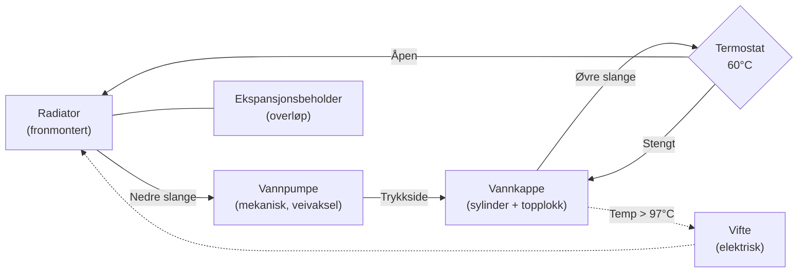

# EBS050 / EBE050 – Derbi 50cc 2-taktsmotor (1995–2005)

Alle Derbi Senda 50-modeller fra 1995 til 2005 bruker **EBE050/EBS050**-motoren – en væskekjølt, 49,76 cc ensylindret totaktsmotor med reed-ventil-innsug og 6-trinns manuell girkasse.

---

## Grunnspesifikasjoner

| Parameter | Verdi |
|-----------|-------|
| Motortype | Énylinder, 2-takt, væskekjølt |
| Slagvolum | 49,76 cc |
| Boring | 39,88 mm |
| Slag | 40,0 mm |
| Motorgeometri | Tilnærmet kvadratisk (boring ≈ slag) |
| Induksjon | Reed-ventil (4-blad membranventil) |
| Brennstoffsystem | Forgasser Dell'Orto PHVA 17,5 mm |
| Tenning | AC CDI (Ducati/Kokusan) |
| Start | Kun kickstart |

## Identifisering

EBS og EBE er funksjonelt identiske for praktiske formål. EBS er den vanligste betegnelsen. Identifiseres ved:
- Motornummer inneholder «EBS» eller «EBE» (merket på nedre motordeksel)
- Kjølevæskeinntaket sitter på **siden av sylinderen** via et utvendig rør

## EBS050 vs. D50B0

Fra 2006 ble EBS/EBE erstattet med **D50B0/D50B1** (Euro 3). Disse motorene er **ikke kompatible**:

| Egenskap | EBS050/EBE050 | D50B0/D50B1 |
|----------|---------------|-------------|
| Produksjonsår | 1995–2005 | 2006– |
| Utslippskrav | Euro 2 | Euro 3 |
| Kjølevæskerør | Utvendig til sylinder | Internt via veivhus |
| Forgasser | Dell'Orto PHVA 17,5 | Dell'Orto PHBN |
| Tenning | AC CDI | DC CDI |

> ⚠️ **Post-2005 D50B0 motordeler er IKKE kompatible** – verifiser alltid motortype ved delebestilling.

## Motorkarakter og termodynamikk

Den nesten perfekt kvadratiske geometrien (boring 39,88 mm / slag 40,0 mm) gir en balanse mellom brukbart dreiemoment i mellomregisteret og kapasitet for høye stempelhastigheter. Kompresjonsforholdet er høyt for en masseprodusert motor, men muliggjøres av det overlegne væskekjølesystemet.

Totaktsprinsippet: Stempelet fungerer som ventil og åpner/stenger eksosporten og spyleportene. Veivhuset opererer som en lufttett trykkveksler – undertrykk suger inn blanding fra forgasseren, overtrykk presser den opp i sylinderen.

## Stempeltilpasning (familiekode)

EBE050-motoren bruker et kodet stempel-til-sylinder matchingsystem med **0,035–0,045 mm klaring**:

| Familie | Stempel Ø (mm) | Sylinder Ø (mm) |
|---------|---------------|-----------------|
| A | 39,850 | 39,890 |
| B | 39,855 | 39,895 |
| C | 39,860 | 39,900 |
| D | 39,865 | 39,905 |

Ring endegap: **0,15–0,35 mm**. Maks sylinderdeformasjon: **0,05 mm**. Pilen på stempelkronen skal peke mot eksosporten.

## Smøresystem

Sykkelen har **Automix oljeinjeksjon** – en mekanisk oljepumpe blander automatisk 2-taktsolje med drivstoff proporsjonalt med gasspådrag.

**Alternativ: Forhåndsblanding (premix)**

| Brukstilfelle | Blandingsforhold | Olje per 5L bensin |
|---------------|------------------|-------------------|
| Normal kjøring | 1:50 | 100 ml |
| Innkjøring ny topp-end | 1:40 | 125 ml |
| Hard bruk / racing | 1:40–1:50 | 100–125 ml |

> ⚠️ Oljepumpens nylondrev kan splintres ved høye turtall. Mange eiere deaktiverer pumpen og premikser for sikkerhet.

## Girolje

Girkassen er adskilt fra motoren og trenger **egen olje**:
- **Type:** SAE 10W-40 (våtklutsj-kompatibel, API GL-4) eller 75W90/80W90 GL-4
- **Volum:** 650 ml
- **Bytteintervall:** Hver 5000 km eller årlig

## Kjølesystem

> Vannpumpen drives mekanisk av veivakselen. Termostaten åpner ved 60°C og sender kjølevæsken gjennom radiatoren. Viften aktiveres ved 97°C.

| Parameter | Verdi |
|-----------|-------|
| Volum | ~1,0–1,1 liter |
| Type | Etylenglykolbasert frostvæske (G12/G13) |
| Blanding | 50/50 frostvæske + destillert vann |
| Termostat åpner | 60°C ±2°C |
| Vifte aktiverer | 97°C ±3°C |

---

## OEM eksploderte diagrammer

Interaktive diagrammer med delenumre (ekstern, copyright OEM):

| System | Modell | Lenke |
|--------|--------|-------|
| Veivaksel / sylinder / stempel | SM X-Race 50 E2 | [oemmotorparts.com](https://www.oemmotorparts.com/en/model/derbi/senda-50-sm-x-race-50-cc-euro2/2004/drawing/drive-shaft-cylinder-piston) |
| Girkasse | SM X-Race 50 E2 | [oemmotorparts.com](https://www.oemmotorparts.com/en/model/derbi/senda-50-sm-x-race-50-cc-euro2/2004/drawing/gear-box) |
| Kobling | SM X-Race 50 E2 | [oemmotorparts.com](https://www.oemmotorparts.com/en/model/derbi/senda-50-sm-x-race-50-cc-euro2/2004/drawing/clutch) |
| Veivhus (carters) | SM X-Race 50 E2 | [oemmotorparts.com](https://www.oemmotorparts.com/en/model/derbi/senda-50-sm-x-race-50-cc-euro2/2004/drawing/carters) |
| Oljepumpe | SM X-Race 50 E2 | [oemmotorparts.com](https://www.oemmotorparts.com/en/model/derbi/senda-50-sm-x-race-50-cc-euro2/2004/drawing/oil-pump) |
| Komplett motoroversikt | SM X-Race 50 E2 | [oemmotorparts.com](https://www.oemmotorparts.com/en/model/derbi/senda-50-sm-x-race-50-cc-euro2/2004/drawing/engine) |
| Alle systemer (25 tegninger) | SM X-Race 50 E2 | [oemmotorparts.com](https://www.oemmotorparts.com/en/model/derbi/senda-50-sm-x-race-50-cc-euro2/2004) |
| Alle systemer | R X-Race E2 2004 | [motorcyclespareparts.eu](https://www.motorcyclespareparts.eu/en/derbi-parts/2004-senda-50-r-x-race-e2-motorcycles) |

> Diagrammene viser eksploderte visninger med originale delenumre. Bruk delenumrene til å søke hos leverandører i [OEM-leverandører](../parts/oem-links.md).

---

## Modellspesifikke motordetaljer

- [Senda R 2004 – Motor](../models/senda-r-2004/README.md#5-motor--ebsebe-familien)
- [Senda SM X-Trem 2005 – Motor](../models/senda-sm-xtrem-2005/README.md#5-motor--ebe050ebs050)
