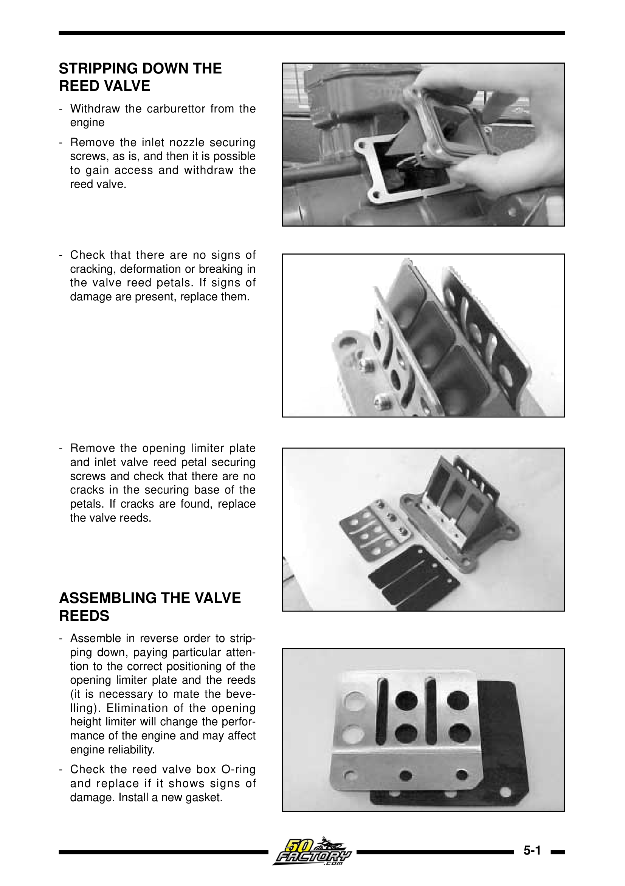
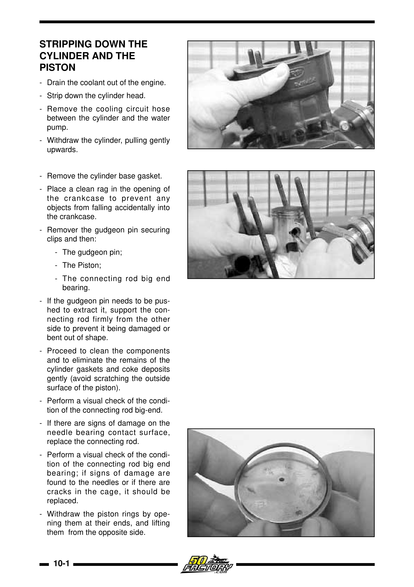
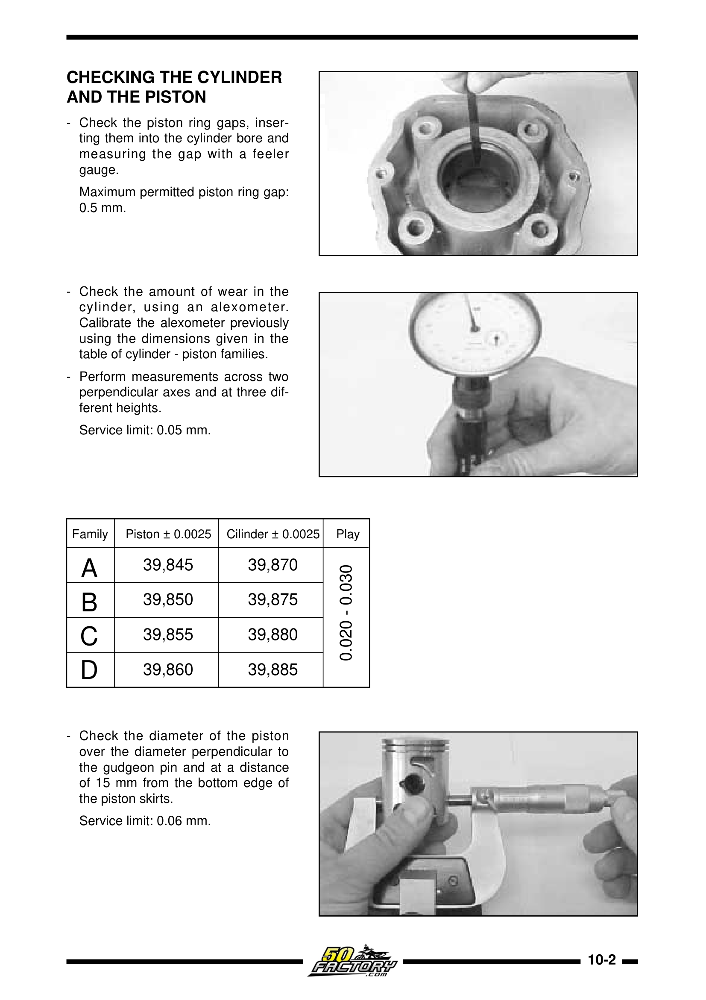
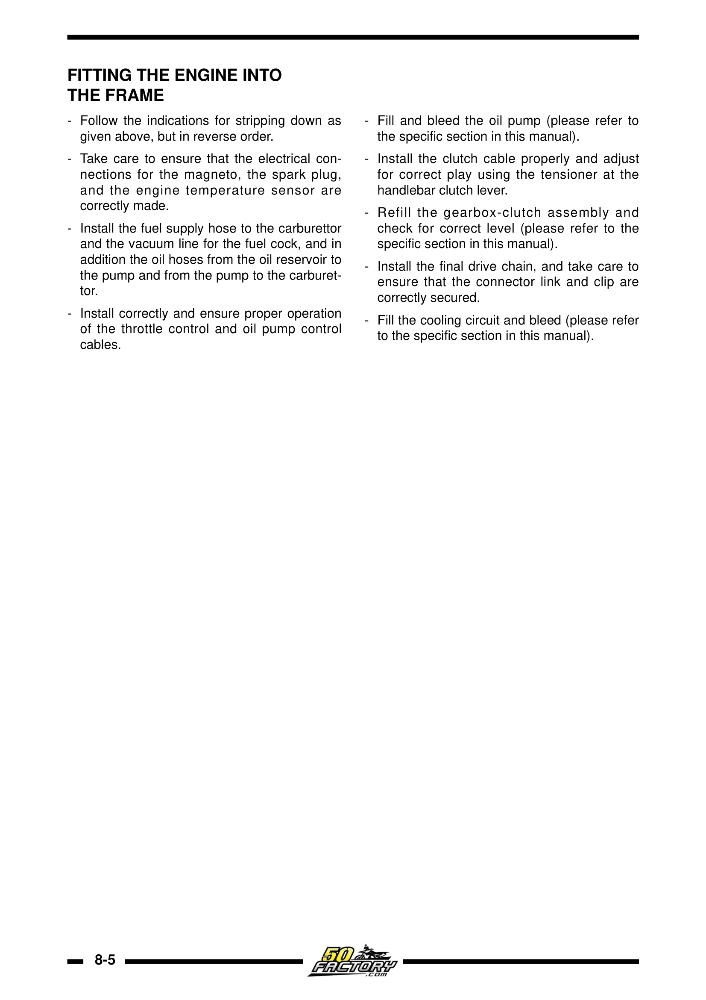
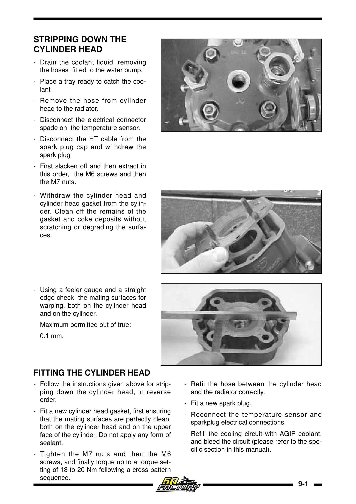
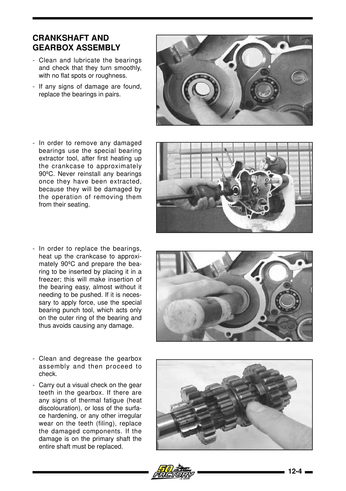
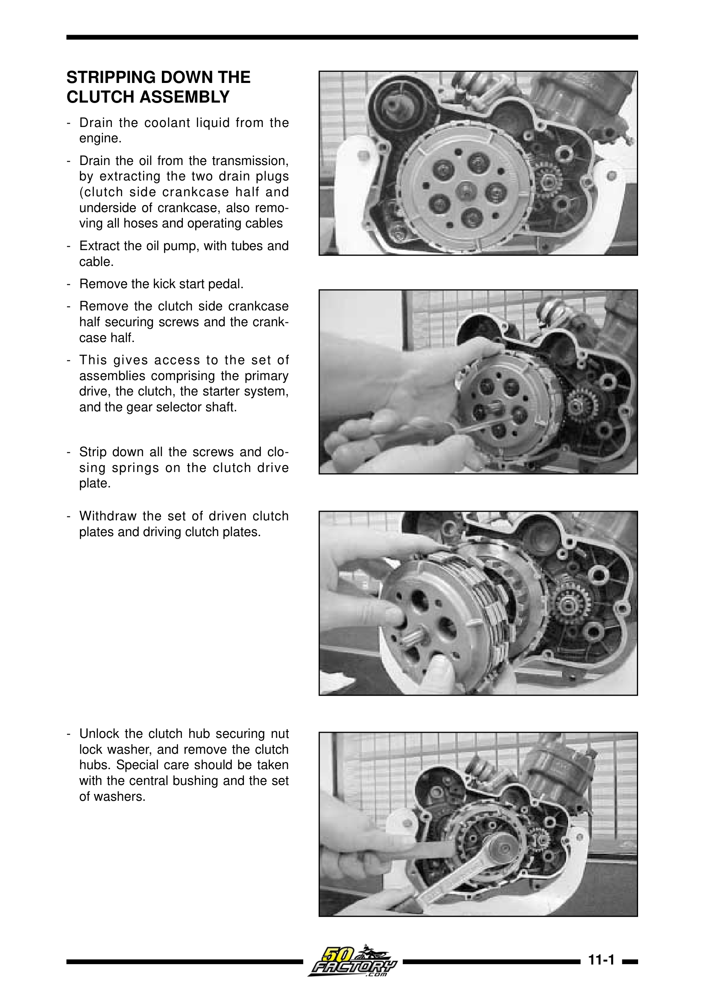
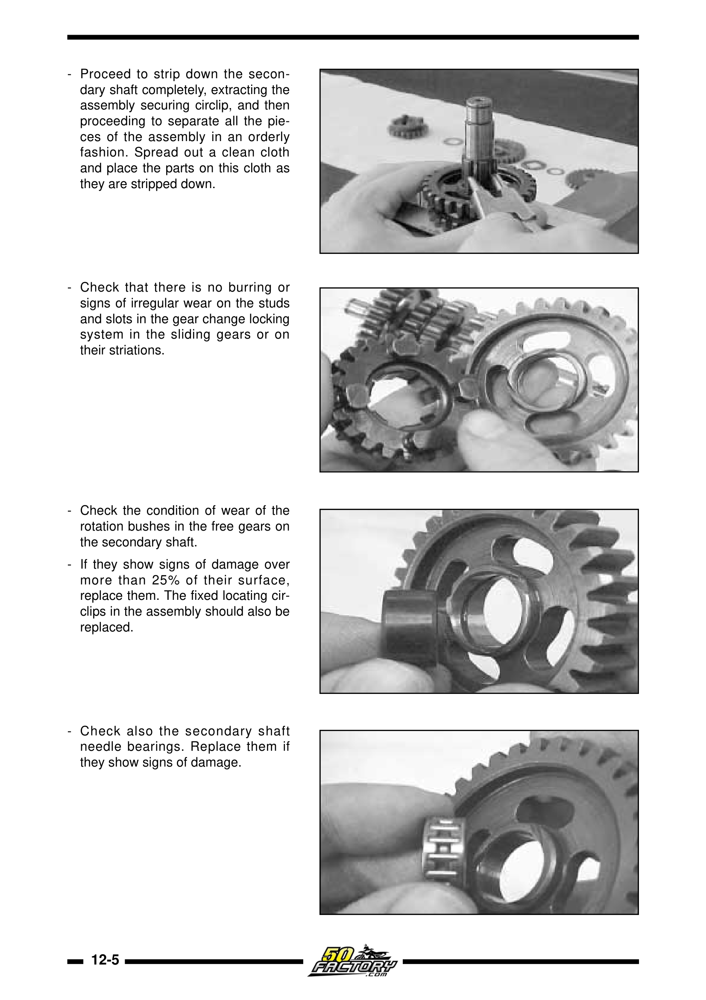
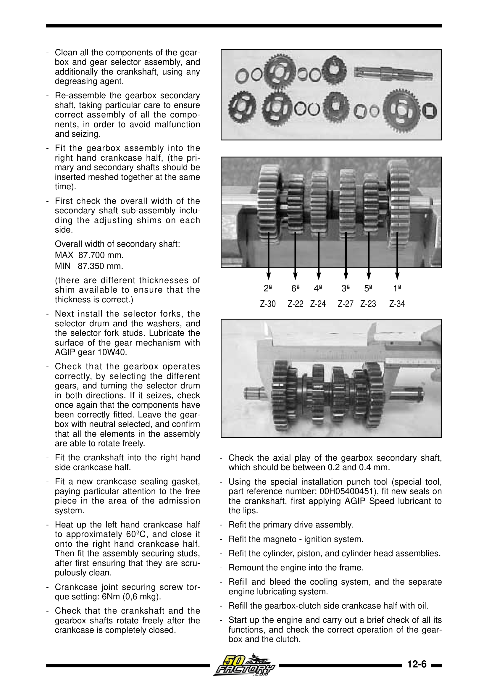
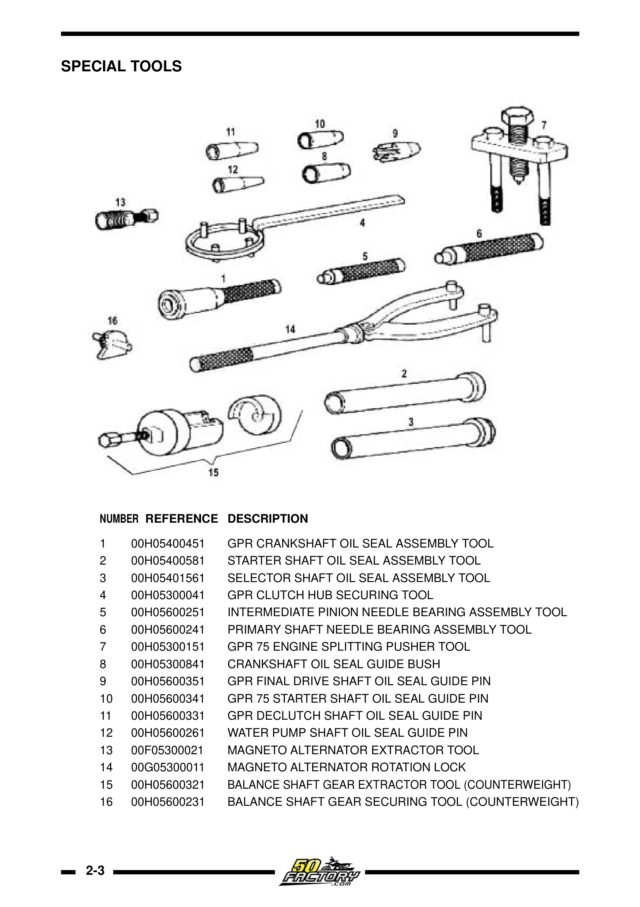

# EBS050 / EBE050 – Derbi 50cc 2-taktsmotor (1995–2005)

Alle Derbi Senda 50-modeller fra 1995 til 2005 bruker **EBE050/EBS050**-motoren – en væskekjølt, 49,76 cc ensylindret totaktsmotor med reed-ventil-innsug og 6-trinns manuell girkasse.

---

## Grunnspesifikasjoner

| Parameter | Verdi |
|-----------|-------|
| Motortype | Énylinder, 2-takt, væskekjølt |
| Slagvolum | 49,76 cc |
| Boring | 39,88 mm |
| Slag | 40,0 mm |
| Motorgeometri | Tilnærmet kvadratisk (boring ≈ slag) |
| Induksjon | Reed-ventil (4-blad membranventil) |
| Brennstoffsystem | Forgasser Dell'Orto PHVA 14 mm (Senda) / PHVA 17,5 mm (GPR) |
| Tenning | AC CDI (Ducati/Kokusan) |
| Start | Kun kickstart |

## Identifisering

EBS og EBE er funksjonelt identiske for praktiske formål. EBS er den vanligste betegnelsen. Identifiseres ved:
- Motornummer inneholder «EBS» eller «EBE» (merket på nedre motordeksel)
- Kjølevæskeinntaket sitter på **siden av sylinderen** via et utvendig rør

## EBS050 vs. D50B0

Fra 2006 ble EBS/EBE erstattet med **D50B0/D50B1** (Euro 3). Disse motorene er **ikke kompatible**:

| Egenskap | EBS050/EBE050 | D50B0/D50B1 |
|----------|---------------|-------------|
| Produksjonsår | 1995–2005 | 2006– |
| Utslippskrav | Euro 2 | Euro 3 |
| Kjølevæskerør | Utvendig til sylinder | Internt via veivhus |
| Forgasser | Dell'Orto PHVA 14 (Senda) | Dell'Orto PHBN |
| Tenning | AC CDI | DC CDI |

> ⚠️ **Post-2005 D50B0 motordeler er IKKE kompatible** – verifiser alltid motortype ved delebestilling.

## Motorkarakter og termodynamikk

Den nesten perfekt kvadratiske geometrien (boring 39,88 mm / slag 40,0 mm) gir en balanse mellom brukbart dreiemoment i mellomregisteret og kapasitet for høye stempelhastigheter. Kompresjonsforholdet er høyt for en masseprodusert motor, men muliggjøres av det overlegne væskekjølesystemet.

Totaktsprinsippet: Stempelet fungerer som ventil og åpner/stenger eksosporten og spyleportene. Veivhuset opererer som en lufttett trykkveksler – undertrykk suger inn blanding fra forgasseren, overtrykk presser den opp i sylinderen.

{ width="450" }
*Reed-ventil (membranventil) demontasje og inspeksjon. Kilde: Derbi Euro 2 Workshop Manual*

## Stempeltilpasning (familiekode)

EBE050-motoren bruker et kodet stempel-til-sylinder matchingsystem med **0,020–0,030 mm klaring** (iht. verkstedmanual s. 47):

| Familie | Stempel Ø (mm) | Sylinder Ø (mm) |
|---------|---------------|------------------|
| A | 39,845 | 39,870 |
| B | 39,850 | 39,875 |
| C | 39,855 | 39,880 |
| D | 39,860 | 39,885 |

Ring endegap: **0,15–0,35 mm** (bytt ved >0,5 mm). Maks sylinderdeformasjon: **0,05 mm**. Stempeldiameter måles 15 mm over underkant av skjørtet, vinkelrett på boltaksen (grense: 0,06 mm slitasje). Pilen på stempelkronen skal peke mot eksosporten.

## Smøresystem

Sykkelen har **Automix oljeinjeksjon** – en mekanisk oljepumpe blander automatisk 2-taktsolje med drivstoff proporsjonalt med gasspådrag.

**Alternativ: Forhåndsblanding (premix)**

| Brukstilfelle | Blandingsforhold | Olje per 5L bensin |
|---------------|------------------|-------------------|
| Normal kjøring | 1:50 | 100 ml |
| Innkjøring ny topp-end | 1:40 | 125 ml |
| Hard bruk / racing | 1:40–1:50 | 100–125 ml |

> ⚠️ Oljepumpens nylondrev kan splintres ved høye turtall. Mange eiere deaktiverer pumpen og premikser for sikkerhet.

## Girolje

Girkassen er adskilt fra motoren og trenger **egen olje**:
- **Type:** SAE 10W-40 (våtklutsj-kompatibel, API GL-4) eller 75W90/80W90 GL-4
- **Volum:** 650 ml
- **Bytteintervall:** Hver 5000 km eller årlig

## Kjølesystem

> Vannpumpen drives mekanisk av veivakselen. Termostaten begynner å åpne ved 67°C og sender kjølevæsken gjennom radiatoren. Ved 75°C er den helt åpen. Viften aktiveres ved 97°C.

| Parameter | Verdi |
|-----------|-------|
| Volum | ~1,0–1,1 liter |
| Type | Etylenglykolbasert frostvæske (G12/G13) |
| Blanding | 50/50 frostvæske + destillert vann |
| Termostat begynner å åpne | 67°C ±3°C |
| Termostat helt åpen | 75°C (3,0 mm vandring) |
| Vifte aktiverer | 97°C ±3°C |
| Vifte deaktiverer | 85°C ±3°C |
| Overopphetings-varsel | 124°C ±3°C |

---

## OEM eksploderte diagrammer

Interaktive diagrammer med delenumre (ekstern, copyright OEM):

| System | Modell | Lenke |
|--------|--------|-------|
| Veivaksel / sylinder / stempel | SM X-Race 50 E2 | [oemmotorparts.com](https://www.oemmotorparts.com/en/model/derbi/senda-50-sm-x-race-50-cc-euro2/2004/drawing/drive-shaft-cylinder-piston) |
| Girkasse | SM X-Race 50 E2 | [oemmotorparts.com](https://www.oemmotorparts.com/en/model/derbi/senda-50-sm-x-race-50-cc-euro2/2004/drawing/gear-box) |
| Kobling | SM X-Race 50 E2 | [oemmotorparts.com](https://www.oemmotorparts.com/en/model/derbi/senda-50-sm-x-race-50-cc-euro2/2004/drawing/clutch) |
| Veivhus (carters) | SM X-Race 50 E2 | [oemmotorparts.com](https://www.oemmotorparts.com/en/model/derbi/senda-50-sm-x-race-50-cc-euro2/2004/drawing/carters) |
| Oljepumpe | SM X-Race 50 E2 | [oemmotorparts.com](https://www.oemmotorparts.com/en/model/derbi/senda-50-sm-x-race-50-cc-euro2/2004/drawing/oil-pump) |
| Komplett motoroversikt | SM X-Race 50 E2 | [oemmotorparts.com](https://www.oemmotorparts.com/en/model/derbi/senda-50-sm-x-race-50-cc-euro2/2004/drawing/engine) |
| Alle systemer (25 tegninger) | SM X-Race 50 E2 | [oemmotorparts.com](https://www.oemmotorparts.com/en/model/derbi/senda-50-sm-x-race-50-cc-euro2/2004) |
| Alle systemer | R X-Race E2 2004 | [motorcyclespareparts.eu](https://www.motorcyclespareparts.eu/en/derbi-parts/2004-senda-50-r-x-race-e2-motorcycles) |

> Diagrammene viser eksploderte visninger med originale delenumre. Bruk delenumrene til å søke hos leverandører i [OEM-leverandører](../parts/oem-links.md).

---

## Modellspesifikke motordetaljer

- [Senda R 2004 – Motor](../models/senda-r-2004/README.md#5-motor--ebsebe-familien)
- [Senda SM X-Trem 2005 – Motor](../models/senda-sm-xtrem-2005/README.md#5-motor--ebe050ebs050)

---

## Klutsj – servicegrenser

Klutsjen er en flerplate våtkobling (multi-disc oil bath) med 650 cc olje felles med girkassen.

| Parameter | Grenseverdi |
|-----------|-------------|
| Lamellbelegg tykkelse | Min. **3,6 mm** (bytt ved slitasje) |
| Lamellkast (warping) | Maks **0,15 mm** |
| Fjærlengde (fri) | Min. **30 mm** (bytt ved deformasjon) |
| Klutsj hub | Sjekk sperretenner, lager og silentblokker |

Monteringsnotater:
- Klutsj-lamellene monteres med merke utover
- Trykkplaten monteres med DERBI-logoen mot hakket i klutsj-huben
- Klutsjkabel:  ~5 mm fritt spill ved hendelen på styret

## Veivaksel – servicegrenser

| Parameter | Grenseverdi |
|-----------|-------------|
| Lateralt slakk i pleuel (store lager) | Maks **0,8 mm** |
| Slakk i pleuellager (X/Y-akser) | Maks **0,05 mm** |
| Veivaksel wobble (mellom kinnene) | Maks **0,06 mm** |
| Sekundæraksel total bredde | 87,350–87,700 mm (shims tilgjengelig) |
| Aksielt spill sekundæraksel | 0,2–0,4 mm |
| Veivhus sammenføyning moment | 6 Nm (0,6 mkg) + Loctite 243 |

---

## Sylinderhode – servicegrenser

| Parameter | Grenseverdi |
|-----------|-------------|
| Planhet topplokk / sylinder | Maks **0,1 mm** avvik (sjekk med fuelergauge + rettlinjal) |
| Tiltrekkingsrekkefølge | M7-muttere først, deretter M6-skruer, kryss-mønster |
| Moment | 18–20 Nm (kryss-mønster, 2–3 omganger) |

---

## Verkstedmanual-illustrasjoner

<figure markdown="span">
  { width="280" }
  { width="280" }
  <figcaption>Demontasje og kontroll av sylinder/stempel. Kilde: Derbi Euro 2 Workshop Manual</figcaption>
</figure>

<figure markdown="span">
  { width="280" }
  { width="280" }
  <figcaption>Sylinderhode demontasje (venstre) og montering (høyre). Kilde: Derbi Euro 2 Workshop Manual</figcaption>
</figure>

<figure markdown="span">
  { width="280" }
  { width="280" }
  <figcaption>Veivaksel/girkasse-montering (venstre) og klutsj-demontasje (høyre).</figcaption>
</figure>

<figure markdown="span">
  { width="280" }
  { width="280" }
  <figcaption>Girkasse demontasje (venstre) og montering (høyre). Kilde: Derbi Euro 2 Workshop Manual</figcaption>
</figure>

{ width="500" }
*Spesialverktøy for EBS/EBE-motoren. Kilde: Derbi Euro 2 Workshop Manual, s. 20*
