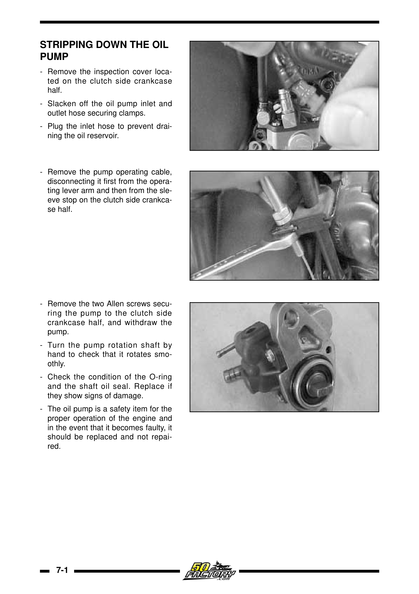
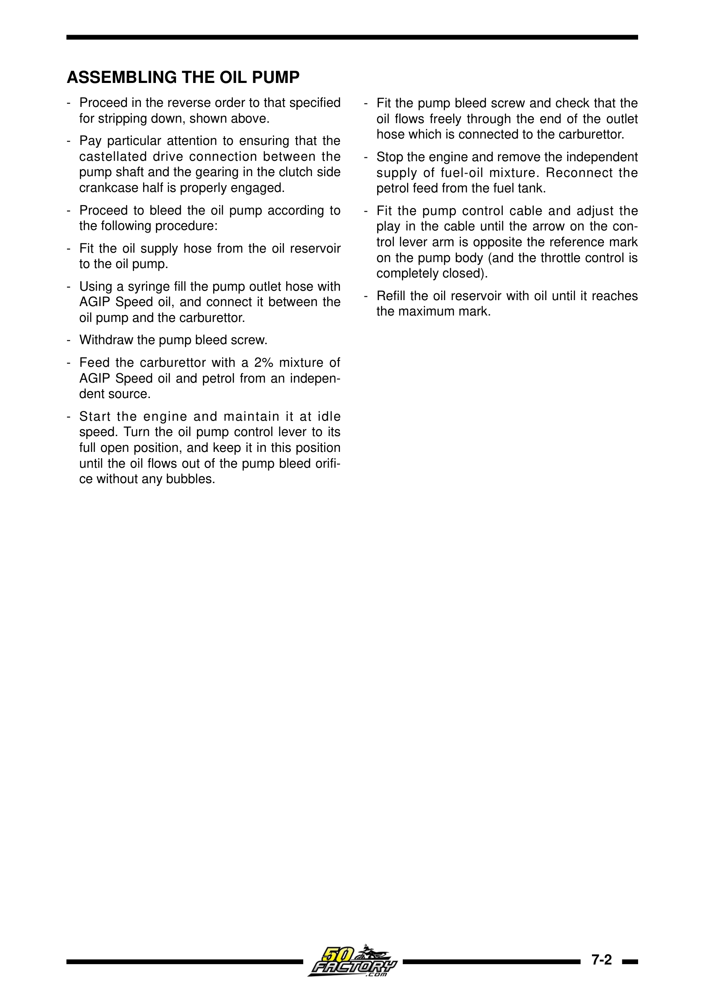

# Væskeoversikt – Derbi Senda EBS/EBE

| Væske | Spesifikasjon | Kapasitet | Intervall |
|-------|--------------|-----------|-----------|
| 2-taktsolje | Syntetisk JASO FD / API TC | ~1,0 L tank | Etterfyll kontinuerlig |
| Girkasseolje | SAE 10W-40 API GL-4 (våtklutsj-kompatibel) | 650 ml | Hver 5000 km / årlig |
| Kjølevæske | Etylenglykol G12/G13, 50/50 m/ dest. vann | ~1,0–1,1 L | Hver 10 000 km / 24 mnd |
| Bremsevæske | DOT 4 | Etter behov | Hver 10 000 km / 24 mnd |
| Gaffelolje | Se tabell under | Se tabell under | Ved lekkasje / overhaul |
| Drivstoff | Blyfri min 95 oktan (98 anbefales) | 7,0–7,45 L | – |

## Gaffelolje – mengder per modell (iht. verkstedmanual)

| Modell | Gaffeltype | Slag (mm) | Olje per bar (cc) | Oljetype |
|--------|-----------|-----------|-------------------|----------|
| Senda R DRD | Marzocchi | 485 | 445 | AGIP 10W |
| Senda R X-Treme | Paioli | 190 | 285 | AGIP 10W |
| Senda SM DRD | Marzocchi | 465 | 445 | AGIP 10W |
| Senda SM X-Treme | Paioli | 175 | 270 | AGIP 10W |
| GPR R | Sebac | 120 | 175 | AGIP 10W |
| GPR Racing | Sebac | 95 | 140 | AGIP 10W |

> Generisk SAE 10W gaffelolje (motorolje er IKKE egnet) kan brukes som erstatning for AGIP 10W. Racer-modeller bruker SAE 7,5W — sjekk verkstedmanualen for din spesifikke variant.

## Anbefalte 2-takts oljer

- **Motul 710 2T / 800 2T** – helsyntetisk, anbefalt av langtidseiere
- **Castrol Power 1 Racing 2T** – helsyntetisk
- **Putoline TT Sport** – helsyntetisk
- **Ipone Scoot Run 2T** – god budsjettsyntetisk
- Enhver **JASO FD**-sertifisert syntetisk olje

> ⚠️ Billig mineralolje oksiderer raskt og avsetter karbon på stempeltopp, låser ringer, blokkerer eksosporten.

## Kjølevæske-spesifikasjon

- **Type:** G12 (rød/gul) eller G13 – OAT-teknologi
- **Fri for:** Silikater, aminer, fosfater, nitritter
- **Blanding:** 50/50 med destillert vann (beskyttelse ned til ~-37°C)

> ⚠️ Silikater i eldre kjølevæsketyper sliter ned vannpumpetetningen og kan forårsake kavitasjon.

## Oljepumpe – service og lufting

<figure markdown="span">
  { width="280" }
  { width="280" }
  <figcaption>Oljepumpe demontasje (venstre) og montering med lufteprosedyre (høyre). Kilde: Derbi Euro 2 Workshop Manual</figcaption>
</figure>
