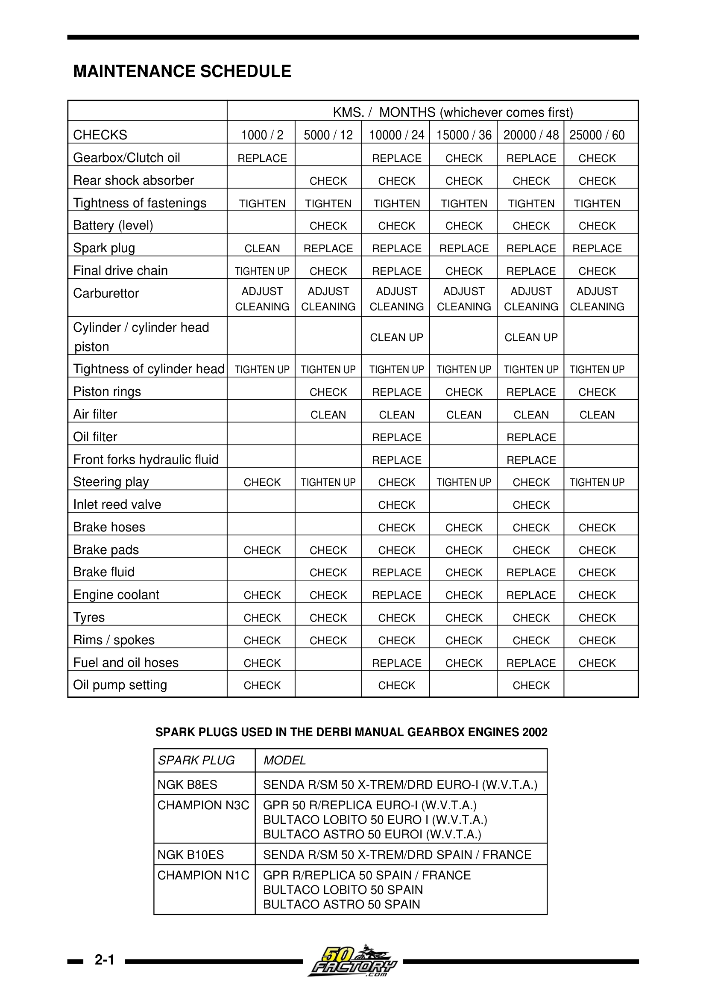

# Vedlikeholdsplan – Derbi Senda EBS/EBE

## Offisielle serviceintervaller

{ width="600" }
*Offisiell vedlikeholdsplan fra Nacional Motor Derbi Euro 2 Workshop Manual, s. 18*

| Intervall | Vedlikehold |
|-----------|------------|
| **1000 km / 2 mnd** (første service) | Girkasseolje-bytte, forgasserkontroll, generell inspeksjon |
| **Hver 1000 km** | Bremser, dekk, kjede: visuell inspeksjon, rens, stramming |
| **Hver 5000 km / årlig** | Girkasseolje-bytte (650 ml 10W-40), tennplugg-sjekk, forgasser rens/justering, luftfilter rens, kjølevæskenivå, membranventil-inspeksjon |
| **Hver 10 000 km / 24 mnd** | Stempel og ringer bytte (KRITISK), kjølevæske-bytte, tennplugg-bytte, bremsevæske-bytte (DOT 4), drivstoff-/oljerør-bytte |
| **Hver 15 000 km** | Topplokk/sylinder-inspeksjon, karbonavleiring-rengjøring, luftfilter-bytte |

## Daglig inspeksjon (før kjøring)

- Dekkslitasje og -trykk
- Bremseklossenes tykkelse
- Alle lyskilder og blinklys
- Drivkjede – stramming (20–30 mm) og smøring

## Sesongsoppstart (sjekkliste)

- [ ] Bytt tennplugg (NGK BR8ES/BR9ES)
- [ ] Sjekk/bytt kjølevæske
- [ ] Sjekk oljenivå (oljepumpe) eller bland drivstoff (1:50)
- [ ] Sjekk girolje – tapp og fyll ved behov (650 ml)
- [ ] Rens forgasser (spesielt etter lang lagring)
- [ ] Sjekk og juster kjede (20–30 mm slakk)
- [ ] Sjekk bremser – klosser og hydraulikkvæske
- [ ] Sjekk gaffentetninger for lekkasje
- [ ] Sjekk dekk – alder, slitasje, lufttrykk
- [ ] Sjekk alle kabler (gass, klutsj, bremse) for strekk og friksjon
- [ ] Test lys, horn og blinklys
- [ ] Sjekk eksospakning

## Vinterlagring

- [ ] Fyll tanken helt (hindrer korrosjon og kondens)
- [ ] Tilsett drivstoffstabilisator og kjør motoren 5 min for sirkulasjon
- [ ] Bytt girkasseolje (forurenset olje = syre over vinteren)
- [ ] Tøm forgasseren (steng bensinkranen, la motoren gå til den dør)
- [ ] Spray WD-40 / korrosjonsbeskyttelse på ubehandlet metall
- [ ] Koble fra batteriet. Vedlikeholdslad 1× per måned
- [ ] Still sykkelen på sentralstativ eller blokker – avlast dekkene
- [ ] Dekk med et pust-vennlig trekk (ikke plast – kondens)

---

## Modellspesifikke vedlikeholdsdetaljer

- [Senda R 2004 – Vedlikehold](../models/senda-r-2004/README.md#10-vedlikehold--service-og-intervaller)
- [Senda SM X-Trem 2005 – Vedlikehold](../models/senda-sm-xtrem-2005/README.md#10-vedlikehold--service-og-intervaller)
