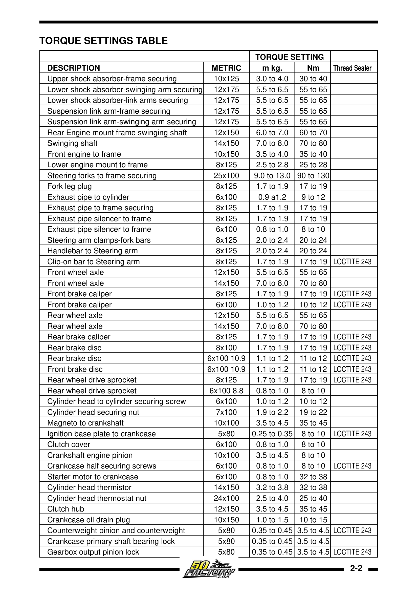

# Momentspesifikasjoner – Derbi Senda EBS/EBE

## Sammenligning per modell

| Feste | Senda R 2004 | Senda SM X-Trem 2005 |
|-------|-------------|---------------------|
| Topplokk-muttere (M7) | 19–22 Nm | 19–22 Nm |
| Topplokk dekselskruer (M6) | – | 8–10 Nm |
| Tennplugg | 18 Nm | 18 Nm |
| Magneto til veivaksel (M10) | – | 35–45 Nm |
| Motor-drev til veivaksel (M10) | – | 35–45 Nm |
| Klutsjhus (M12) | – | 35–45 Nm |
| Veivhus-bolter (M6) | – | 8–10 Nm |
| Oljetapp-skrue (M10) | – | 15–18 Nm |
| Termistor til topplokk (M14) | – | 32–38 Nm |
| Girvelger-stopper (M8) | – | 15–19 Nm |
| Membranblokk-skruer (M3) | – | 1–2 Nm |
| Oljepumpe til veivhus (M5) | – | 3,5–4,5 Nm |
| Hjulaksel | 60 Nm | 80 Nm |

> SM 2005-verdiene er hentet direkte fra verkstedmanualen. R 2004-verdiene er fra registerdata/eierdokumentasjon.
> Hjulaksel-moment varierer mellom modellene på grunn av ulike hjulstørrelser (R: 21"/18" vs. SM: 17"/17").

### Komplett momenttabell fra verkstedmanualen

{ width="600" }
*Offisiell momenttabell med gjengespesifikasjoner og Loctite-krav. Kilde: Nacional Motor Derbi Euro 2 Workshop Manual, s. 19*

## Modellspesifikke momenttabeller

- [Senda R 2004 – Momentspesifikasjoner](../models/senda-r-2004/README.md#momentspesifikasjoner)
- [Senda SM X-Trem 2005 – Momentspesifikasjoner](../models/senda-sm-xtrem-2005/README.md#momentspesifikasjoner-nm)
