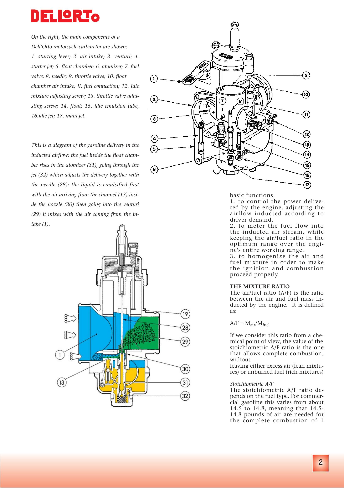
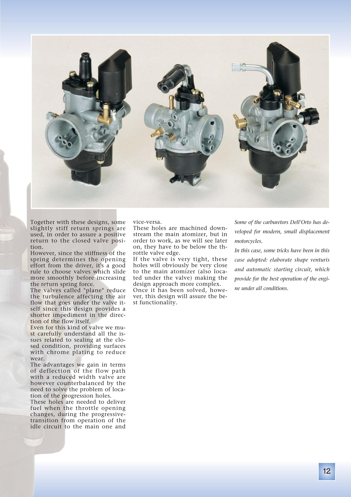
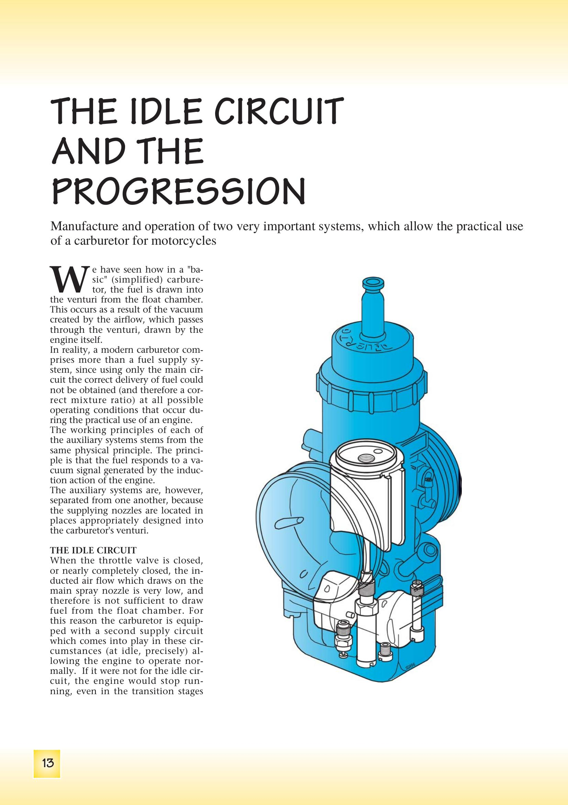
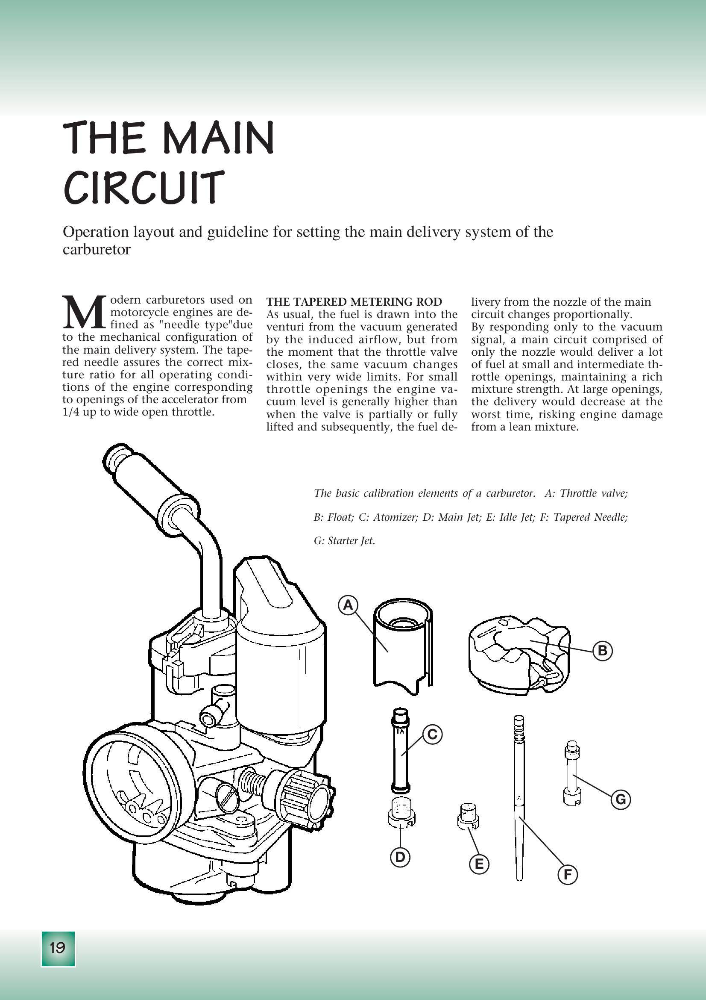
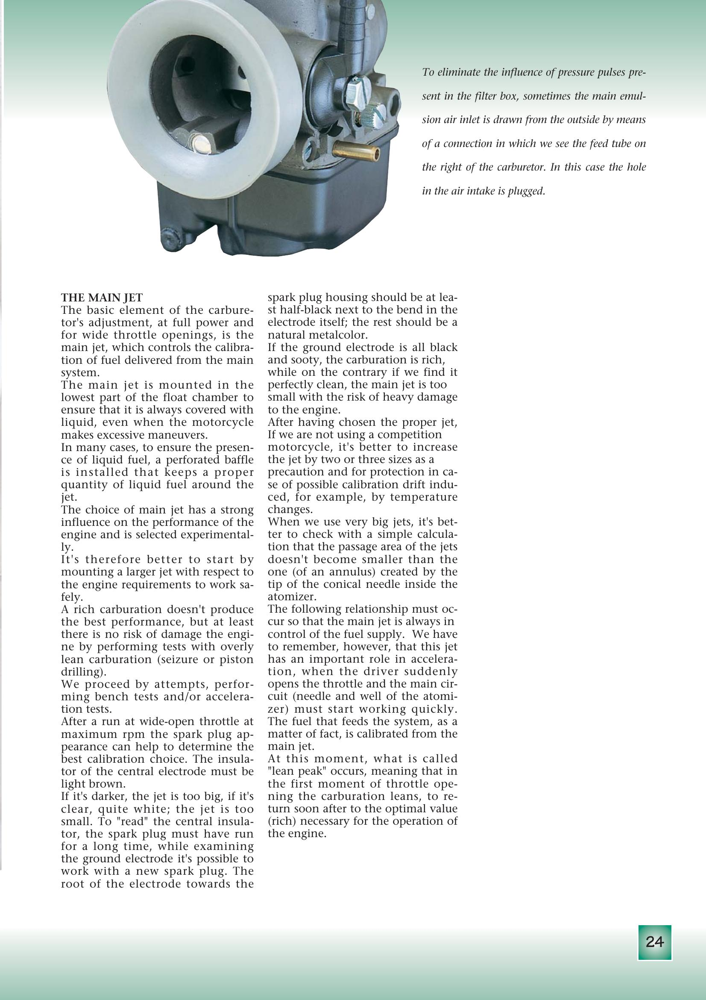

# Manualer og dokumentasjon

## Gratis verksted- og eiermanualer

| Manual | Lenke |
|--------|-------|
| Derbi offisielle manualer | https://manuals.derbi.com/ |
| Derbi 50cc 6-speed Engine Workshop Manual (offisiell) | https://www.50factory.com/pdf/telecharger/Derbi%20Senda%20-%20Revue%20technique%20-%20Anglais.pdf |
| Derbi Euro 2 Workshop Manual (73 sider, koblingsskjemaer) | https://www.manualslib.com/manual/1619038/Nacional-Motor-Derbi-Euro-2.html |
| 393-siders eiermanual (Senda 50 DRD Racing X-Treme, flerspråklig) | https://www.manualslib.com/manual/3170322/Derbi-Senda-50-Drd-Racing-X-Treme.html |
| Senda DRD Racing Workshop Manual (867267) | https://www.scribd.com/document/786054674/867267-Senda-DRD-Racing-En |
| Derbi Senda Service Manual DRD | https://www.scribd.com/doc/59179403/Derbi-Senda-Service-Manual-DRD-Model |
| Derbi Euro 3 Workshop Manual (D50B0-referanse) | https://www.50factory.com/pdf/telecharger/documentation%20atelier%20%20Derbi%20Euro%203%20anglais.pdf |
| Derbi EBE/EBS werkplaatshandboek (nederlandsk forum) | https://www.derbi-forum.nl/download/werkplaatshandboek/DerbiBakHandboek.pdf |
| MotorcycleManuals.info | https://www.motorcyclemanuals.info/motocycles-atvs/derbi/ |

## Forgassermanual – Dell'Orto

| Manual | Lenke |
|--------|-------|
| Dell'Orto Tuning Manual (PDF, lokal kopi) | [dellorto_manual.pdf](../pdf/dellorto_manual.pdf) |
| Dell'Orto Tuning Manual (offisiell) | https://www.dellorto.it/wp-content/uploads/2020/12/dellorto_manual.pdf |

Alle illustrasjoner fra Dell'Orto-manualen er hentet ut og brukt i [forgasserdokumentasjonen](../carburetors/dellorto-phva.md) og [justeringsguiden](../carburetors/tuning-guide.md).

### Utvalgte sider fra Dell'Orto Tuning Manual

| Side | Innhold |
|------|---------|
| { width="120" } | **Komponenter og kretser** – Oversikt over alle forgasserkretser |
| { width="120" } | **Små forgassere (PHVA)** – PHVA-serien for småsylindrede motorer |
| { width="120" } | **Tomgangskrets** – Introduksjon til tomgangssystemet |
| { width="120" } | **Hovedkrets** – Hovedsystemet med hoveddyse, nål og atomiser |
| { width="120" } | **Hoveddyse og plugglesing** – Hvordan lese tennpluggen (plug chop) |

## Delekataloger

| Kilde | Lenke |
|-------|-------|
| CarlSalter.com – flere Senda delslister | https://www.carlsalter.com/derbi-service-manuals.asp |
| Motorcycle-Manual.com | https://www.motorcycle-manual.com/derbi/ |

## Innhold i verkstedmanualen (EBS 6-girs)

Manualen (Nacional Motor S.A.U.) dekker:
- Vedlikehold, kjøretøyidentifikasjon, generelle tekniske spesifikasjoner
- Demontasje og montering av motor (komplett)
- Forgasser, hjuloppheng og bremser
- Elektrisk diagram og koblingsskjemaer
- Strammomenter for alle skruer
- Slitasjetoleranser (mikrometermål)
- Spesialverktøy (avdrager for svinghjul, motholdstang for kløtsj, osv.)

> Manualen forutsetter grunnleggende forståelse for mekaniske prinsipper.
