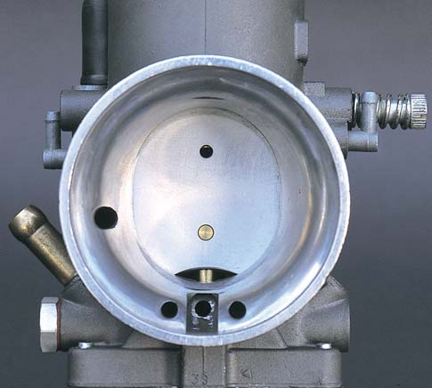
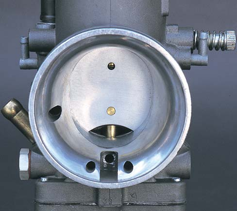

# Derbi Senda R 50 – 2004 (NL 3874)

> **Registreringsnummer:** NL 3874
> **VIN/Chassisnr.:** VTHSR1B1A4H248026
> **Registrert første gang:** 24.06.2004 (Norge)
> **Eierskifte:** 30.04.2025
> **Kjøretøygruppe:** Moped L1e

---

## Innholdsfortegnelse

1. [Merke- og modellhistorie](#1-merke--og-modellhistorie)
2. [Modellbeskrivelse – Senda R 2004](#2-modellbeskrivelse--senda-r-2004)
3. [VIN-dekoding](#3-vin-dekoding)
4. [Tekniske spesifikasjoner](#4-tekniske-spesifikasjoner)
5. [Motor – EBS/EBE-familien](#5-motor--ebsebe-familien)
6. [Forgasser – Dell'Orto PHVA 17,5](#6-forgasser--dellorto-phva-175)
7. [Transmisjon og drivverk](#7-transmisjon-og-drivverk)
8. [Chassis, hjuloppheng og bremser](#8-chassis-hjuloppheng-og-bremser)
9. [Elektrisk system](#9-elektrisk-system)
10. [Vedlikehold – service og intervaller](#10-vedlikehold--service-og-intervaller)
11. [Diagnostikk og feilsøking](#11-diagnostikk-og-feilsøking)
12. [Tuning (kun til informasjon)](#12-tuning-kun-til-informasjon)
13. [Rask referansekort](#13-rask-referansekort)

> Felles informasjon om merkehistorie, Senda-plattformen, L1e-regler, manualer, leverandører, verksteder og forum: se [hovedsiden](../../README.md).

---

## 1. Merke- og modellhistorie

> For fullstendig Derbi-historie og Senda-plattformbeskrivelse, se [hovedsiden](../../README.md).

Din sykkel tilsvarer **Senda R X-Race / X-Treme**-varianten fra 2004 (Euro 2) og representerer høydepunktet av den opprinnelige EBS/EBE-motorgenerasjonen.

---

## 2. Modellbeskrivelse – Senda R 2004

2004-modellen er en modningsvare. Aluminiumsrammen fra 2000 er beholdt, og sykkelen er Euro 2-sertifisert. De mest kjente visuelle endringene fra 2003 til 2004 er oppdatert frontlys (to runde enheter). Ellers er motor, chassis, fjæring, bremser og hjul uendret fra foregående generasjon.

R-varianten skiller seg fra SM-varianten gjennom:
- 21-tommers fronthjul med krysspeiking (Wire-spoke)
- 18-tommers bakhjul med krysspeiking
- Lengre fjæringsreise (offroad-orientert)
- Høyere bunnklarering

---

## 3. VIN-dekoding

**VIN:** `VTHSR1B1A4H248026`

| Posisjon | Kode | Betydning |
|----------|------|-----------|
| 1–3 | VTH | Produsent: Derbi (Nacional Motor S.A.) |
| 4–5 | SR | Modell: Senda R |
| 6 | 1 | Variant/serie |
| 7 | B | Karosseritype |
| 8 | 1 | Motortype (EBS 50cc) |
| 9 | A | Kontrollsiffer |
| 10 | 4 | Modellår: **2004** |
| 11 | H | Produksjonsanlegg |
| 12–17 | 248026 | Løpende produksjonsnummer |

> **Motorens serienummer** befinner seg på høyre side av styrehodet (rammenummeret) og på motorblokkens venstre side. Motoridentifisering: inneholder «EBS» eller «EBE» i nummeret.

---

## 4. Tekniske spesifikasjoner

### Registerdata (Statens vegvesen)

| Parameter | Verdi | Operasjonell implikasjon |
|-----------|-------|--------------------------|
| Merke og modell | Derbi Senda R 2004 | |
| Kjøretøygruppe | Moped (L1e) | Maks 45 km/t, maks 49 cm³ |
| Topphastighet | 45 km/t | |
| Lengde | 210 cm | Lang akselavstand gir retningsstabilitet over ujevnt terreng |
| Bredde | 83 cm | Bredt motocross-styre for presis kontroll |
| Egenvekt | 96 kg | Svært lett – gunstig vekt/effekt-forhold |
| Egenvekt med fører | 171 kg | Basert på standardisert førervekt 75 kg |
| Tillatt totalvekt | 270 kg | Strukturell maks for ramme og hjuloppheng |
| Maks nyttelast | 99 kg | |
| Maks aksellast foran | 80 kg | Lettere front favoriserer offroad-oppsett |
| Maks aksellast bak | 190 kg | Overdimensjonert bakfjæring for terrengbruk |
| Slagvolum | 49 cm³ | |
| Drivstoff | Bensin | |
| Motorytelse | 2,6 kW (≈4 hk) | Begrenset for L1e-klasse |
| Dekk foran (std.) | 80/90-21 | |
| Dekk bak (std.) | 110/80-18 | |
| Hastighetsindeks | B (50 km/t) | |
| Lastindeks foran | 20 (80 kg) | |
| Lastindeks bak | 50 (190 kg) | |
| Antall seter | 1 | |

### Motorspesifikasjoner (EBS-motor)

| Parameter | Verdi |
|-----------|-------|
| Motortype | Énylinder, 2-takt, væskekjølt |
| Slagvolum | 49,93 cc (registrert som 49 cm³) |
| Boring | 39,88 mm |
| Slag | 40,0 mm |
| Motorgeometri | Tilnærmet kvadratisk (boring ≈ slag) |
| Kompresjonsforhold | 11,5:1 (noen kilder oppgir opp til 13,0:1) |
| Klemspalte (squish clearance) | 0,9 mm |
| Distribusjonsdiagram | Eksosport: 186° / Spyleporter: 126° / Blowdown: 60° |
| Induksjon | Reed-ventil (4-blad) |
| Kjølesystem | Væskekjølt (radiator, vannpumpe, ~1,0 liter) |
| Brennstoffsystem | Forgasser Dell'Orto PHVA 17,5 mm |
| Tenning | CDI med rotor/generator (85W/120W) |
| Tennplugg | NGK BR9ES / BR9EG / BR9EIX / BR8ES |
| Elektrodegap | 0,6 mm |
| Start | Kickstart |
| Tankvolum | 7,45 liter |
| Ubegrenset fabrikkytelse | ~5 bhp |

### Momentspesifikasjoner

| Komponent | Moment |
|-----------|--------|
| Tennplugg | 18 Nm |
| Sylinderhode | 19–22 Nm |
| Hjulaksel | 60 Nm |

---

## 5. Motor – EBS/EBE-familien

EBS/EBE er en velprøvd 2-takts vannkjølt motor brukt i Senda fra 1995 til 2005. Etter 2005 ble den erstattet med D50B0/D50B1. 2004-modellen representerer den mest raffinerte iterasjonen av EBS/EBE-generasjonen – en motor hyllet for sin mekaniske robusthet og sitt enorme potensial.

### Identifisering EBS vs. EBE

Begge er funksjonelt identiske for praktiske formål. EBS er den vanligste betegnelsen. Identifiseres ved:
- Motornummer inneholder «EBS» eller «EBE»
- Kjølevæskeinntaket sitter på **siden av sylinderen**

### Motorkarakter og termodynamikk

Den nesten perfekt kvadratiske geometrien (boring 39,88 mm / slag 40,0 mm) gir en balanse mellom brukbart dreiemoment i mellomregisteret og kapasitet for høye stempelhastigheter. Kompresjonsforholdet på 11,5:1 (noen kilder oppgir opp til 13,0:1) er høyt for en masseprodusert 50cc-motor, men muliggjøres av det overlegne væskekjølesystemet. Minimum 95 oktan, 98 oktan anbefales sterkt. Avvik risikerer detonasjon («tenningsbank»).

Klemspalten på 0,9 mm skaper ekstrem turbulens som sikrer homogen forbrenning. Feil tykkelse på sylinderfotpakning (f.eks. 1,5 mm) vil ødelegge denne effekten dramatisk.

Port-timingen (eksosport 186°, spyleporter 126°) gir en 60° blowdown-fase og resulterer i et tydelig kraftbånd som slår inn over ~7500 o/min.

### Reed-ventil (innsugssystem)

Reed-ventilen fungerer som en enveisventil – slipper innsuget inn ved undertrykk og stenger ved overtrykk. Originale blader er av plast/rustfritt stål. Oppgradering til karbonfiberblader (f.eks. Malossi TPR Black Reed Valve, Polini) forbedrer gassrespons og forhindrer «reed flutter» ved høye turtall.

### Smøresystem – 2-taktsolje

Sykkelen har **automatisk oljepumpe** (Autolube/automix). Separat oljetank mates inn i forgasseren basert på gasspådrag.

**Anbefalt 2-takts olje:**
- Motul 710 2T (syntetisk) – anbefalt av mange langtidseiere
- Ipone Scoot Run 2T
- LiquiMoly (delsyntetisk), Bel Ray 2T, Castrol
- Enhver JASO FD-sertifisert syntetisk 2-taktsolje

> ⚠️ Billig olje vil raskt oksidere og etterlate karbondeponering på stempeltoppen, låse stempelringer, blokkere eksosporten og fylle ekspansjonskammeret med sot.

**Alternativ: Forhåndsblanding**

Mange eiere deaktiverer oljepumpen og forhåndsblander bensin og olje:

| Brukstilfelle | Blandingsforhold |
|---------------|------------------|
| Normal kjøring | 1:50 (2%) |
| Hard bruk | 1:40 (2,5%) |
| Ny motor / etter renovering | 1:33 (3%) |

Bruk blyfri 95 eller 98 oktan.

> ⚠️ Mange eiere deaktiverer oljepumpen fordi det lille nylondrevet som driver pumpen kan splintres ved høye turtall – et havari uten forvarsel. Dersom du er usikker på om oljepumpen fungerer på en 21 år gammel sykkel – inspiser den grundig eller bytt til forhåndsblanding. En tørr 2-takt ødelegges raskt.

### Girolje (separat!)

Girkassen er adskilt fra motoren og trenger **egen olje**:
- **Type:** 10W-30 / 10W-40 motorolje, eller 75W90/80W90 GL-4 girolje
- **Volum:** 650 ml (EBS050/EBE050)
- Påfyllingsplugg og avtappingsplugg finnes på venstre side av motoren

**Bytteprosedyre:**
1. Varmkjør motoren forsiktig noen minutter (senker viskositeten)
2. Skru ut dreneringspluggen under motorblokken – samle opp gammel olje
3. Fyll ny olje gjennom påfyllingspluggen på toppen
4. På høyre side av kløtsjdekselet finnes en nivåskrue («weep hole»). Fyll til oljen akkurat drypper ut av nivåhullet med sykkelen i loddrett stilling
5. Stram nivåskruen og påfyllingspluggen
6. Kjør en kort prøvetur (~10 min), kom tilbake og etterfyll til nivået er perfekt

### Kjølesystem

Systemet består av frontmontert radiator, slanger, vannpumpe og vannkappe integrert i sylinderen.

- **Volum:** ~1,0 liter
- **Type:** Etylenglykolbasert antifrost, G12 (rød/gul) eller G13 – OAT-teknologi, fri for silikater, aminer, fosfater og nitritter
- **Blanding:** 50/50 frostvæske + destillert vann (beskyttelse ned til ~-37°C)
- **Bytte:** Etter drenering og påfylling, luft systemet med motoren i gang og radiatorkorken av for å fordrive luftlommer

> ⚠️ Silikater i eldre kjølevæsketyper sliter ned vannpumpetetningen over tid og kan forårsake kavitasjon. Innestengt luft skaper «hot spots» som kan smelte toppakningen.

---

## 6. Forgasser – Dell'Orto PHVA 17,5

Standardforgasseren er Dell'Orto PHVA 17,5 mm. I visse markeder eller årganger ble også Keihin benyttet.

<figure markdown="span">
  { width="250" }
  { width="250" }
  <figcaption>Dell'Orto PHVA 17,5 mm. <em>Kilde: Dell'Orto Tuning Manual</em></figcaption>
</figure>

### Spesifikasjoner

| Parameter | Fabrikk (urestriktert) | Begrenset (L1e) |
|-----------|------------------------|-----------------|
| Hoveddyse (main jet) | 85 | 74 (noen markeder: 72–75) |
| Nålejett | A13, hakk #2 | – |
| Tomgangsdyse (pilot jet) | 30 | 30 (noen markeder: 34–36) |
| Forgasserstørrelse | 17,5 mm | 17,5 mm |
| Luftskrue | – | 1,5–2,5 svinger ut |
| Nål | – | Midterste hakk |

### Forgasserjustering – tomgang

1. Varm opp motoren til driftstemperatur
2. Juster tomgangsskruen til jevnt og stabilt løp (~1800–2000 RPM)
3. Juster luftskruen for høyest tomgang (¼-dreis om gangen)
4. Re-juster tomgangsskruen
5. Sjekk at tomgang holder seg etter gassgiving

### Rengjøring

Forgasseren må rengjøres regelmessig på eldre maskiner:
1. Demonter forsiktig (merk alle slanger)
2. Bruk forgasserrens spray på alle kanaler og dyser
3. Rens nålejett og hoveddyse med trykkluft – **aldri tynn ståltråd**
4. Sjekk flottørnivå og flottørnålstetting

---

## 7. Transmisjon og drivverk

### Primærutveksling

Veivakselens kraft overføres via rettskårne tannhjul (straight cut gears) til girkassen. Rettskårne tannhjul minimerer friksjonstap og genererer null skadelige aksialkrefter, men gir en karakteristisk hvinende lyd under akselerasjon.

### Girkasse (6-trinns sekvensiell)

| Gir | Tannhjulratio |
|-----|---------------|
| 1 | 11/34 |
| 2 | 15/30 |
| 3 | 18/27 |
| 4 | 20/24 |
| 5 | 22/23 |
| 6 | 23/22 |
| Primær | 21/78 |

Utvekslingsforholdene er tettsteget (close-ratio) – en nødvendighet for å utnytte den smale effektkurven til en 50cc totaktsmotor.

### Kopling

Våt, flerskive kopling som opererer i eget girkasseoljebad. Koplingskabelen strekkes over tid – juster ved justeringsskruen ved koplingshendelen.

### Kjede og tannhjul

| Komponent | Spesifikasjon |
|-----------|---------------|
| Fremre tannhjul | 14 tenner |
| Bakre tannhjul | 52 tenner |
| Kjedestandard | 420 (smalt, standard moped) |

**Kjedejustering:** Slakket bak bør være ca. 20–30 mm. Juster via akselbolter på bakaksel. Kjedet må inspiseres regelmessig – et for stramt kjede ødelegger lagrene på utgående aksel; et for slakt kjede kan hoppe av og blokkere bakhjulet.

---

## 8. Chassis, hjuloppheng og bremser

### Ramme

Perimeterramme av stål (twin-spar) – to parallelle stålbjelker omkranser motoren fra styrehodet til svingarminnfestingen. Minimerer lateral og torsjonell vridning og gir direkte taktil tilbakemelding fra underlaget.

### Fjæring

| Posisjon | Type | Fjæringsreise | Detaljer |
|----------|------|--------------|----------|
| Foran | Teleskopgaffel (konvensjonell, Paioli/Marzocchi) | ~190 mm | 36 mm eller 41 mm rørdiameter. Ledende foraksel (leading axle) – akselen montert foran senterlinjen til gaffelbena for økt stabilitet i løst terreng |
| Bak | Monoshock (stålsvingarm, Paioli e.l.) | ~180 mm | Lineær gass-støtdemper. Mulig forspenningsjustering (preload) |

**Gaffelolje:** 10W mineral (standard anbefaling for Derbi Senda EBS)

> ⚠️ Sjekk gaffeltetningene regelmessig. Lekkende tetninger gir redusert dempeeffekt og risiko for oljefilm på bremseskiven.

### Bremser

| Posisjon | Type |
|----------|------|
| Foran | Hydraulisk skivebremse, ~260 mm rotor, en-stemplet kaliper |
| Bak | Hydraulisk skivebremse, ~180 mm rotor, en-stemplet kaliper |

Ingen ABS. Bremsesystemet er overdimensjonert for et kjøretøy med 45 km/t toppfart – god sikkerhetsmargin.

**Bremseservice:**
- Sjekk klosstykkelse (minimum ~1 mm friksjonsmateriale)
- Sjekk bremsevæskenivå (DOT 4) – ukentlig
- Bytt bremsevæske hvert 2. år (hygroskopisk absorpsjon senker kokepunkt → risiko for «brake fade»)
- Bleed systemet ved svampete bremseføling

### Hjul og dekk

| Posisjon | Spesifikasjon |
|----------|--------------|
| Foran | 80/90-21, lastindeks 20, B-indeks |
| Bak | 110/80-18, lastindeks 50, B-indeks |

21/18-tommers hjulkombinasjonen er standarden innen offroad og motocross. Det store forhjulet gir lav rullemotstand over ujevnt terreng og god gyroskopisk stabilitet. B-hastighetsindeks er sertifisert for 50 km/t.

### Lufttrykk (anbefalt)

| Posisjon | Offroad | Vei |
|----------|---------|-----|
| Foran | ~1,0–1,2 bar | ~1,5 bar |
| Bak | ~1,2–1,5 bar | ~1,8 bar |

---

## 9. Elektrisk system

### Todelt arkitektur

Det elektriske systemet er todelt:
- **Tenningskrets (CDI)** – totalt uavhengig av resten; motoren starter og går selv uten batteri
- **Lys/ladekrets** – mater lys og lader batteri via regulator/likeretter

### Nøkkelkomponenter

| Komponent | Spesifikasjon |
|-----------|--------------|
| Stator | Magnetoalternator |
| Generator/rotor | 85W / 120W |
| CDI-enhet | AC CDI, Ducati/Kokusan. OEM: **8212474** / **11.20632 800** / **00H03330171** |
| Batteri | 12V (typisk 5–7 Ah YTX5L-BS eller tilsvarende) |
| Tennplugg | NGK BR9ES (standard) / BR8ES (varmere, bykjøring) / BR9EIX (iridium-oppgradering) |
| Elektrodegap | 0,6 mm |
| Pluggmål | Gjengediameter 14,0 mm, gjengelengde 19,0 mm, 20,8 mm nøkkelvidde |

### AC CDI – hvordan det fungerer

Statorspolens høyspente vekselstrøm lader kondensatoren i CDI-boksen. Når pick-up-spolen registrerer at svinghjulets metallflik passerer, åpner en SCR (Silicon Controlled Rectifier) som dumper energien til tennspolen. Tennspolen mangedobler spenningen til over 20 000V.

Maskinen stanses ved at tenningslås/dødmannsknapp jorder CDI-ens høyspenningskabel.

> **Viktig:** Systemet er totalt uavhengig av batteri og regulator. Motoren starter og går uten disse.

### Tenningssystem – signalvei

```
Stator → CDI → Tennspole → Tennplugg
Kill switch → CDI (jorder for å stoppe)
Regulator → Lys/lading
```

### Stator-diagnostikk (multimeter)

| Kretskomponent | Ledningsfarge | Måles mot | Normal motstand |
|----------------|---------------|-----------|-----------------|
| Høyspennings ladespole (CDI) | Grønn | Jord | ~670 Ω (±10%) |
| Pick-up / trigger-spole | Rød | Jord | 80–90 Ω (±10%) |
| AC/DC ladekrets (lys/batteri) | Gul | Jord | ~0,7 Ω (±10%) |
| Hovedjording / kill-switch | Gul/grønn eller hvit | Chassis | Kontinuitet (0 Ω) |
| Sekundær høyspenningscoil | Pluggkabel | Tennplugghette | 3,7–5,0 kΩ (±15%) |
| Støydempet tennplugghette | Hetten i seg selv | Gjennomgang | ~5 kΩ (±15%) |

Avvik fra disse verdiene: ∞ = ledningsbrudd, ~0 Ω = kortslutning.

### Spenningsregulator – servicebulletin PV 05-10

Derbi utstedte oppdatering som erstattet original regulator:
- **Original:** delenr. 00H01004841 (lys blå kontakt)
- **Oppdatert:** delenr. 864660 (gul kontakt)

> ⚠️ Feil wattasje på frontlyspære kan blåse statoren.

### Ledningsskjema

Den definitive kilden er Nacional Motor Derbi Euro 2 Workshop Manual:
- **Side 72 – SM X-Treme WVTA koblingsskjema:** https://www.manualslib.com/manual/1619038/Nacional-Motor-Derbi-Euro-2.html?page=72
- **Side 59 – Batterilading og regulator:** https://www.manualslib.com/manual/1619038/Nacional-Motor-Derbi-Euro-2.html?page=59
- **50factory.com visuell ledningsguide med bilder:** https://en.50factory.com/content/244-changing-his-electric-beam-on-derbi-senda-and-gilera-smt-RCR

> Koblingsskjemaene gjelder hele Senda-plattformen (SM og R deler identisk elektrisk arkitektur).

### Fargekodetabell (viktigste)

| Tilkobling | Ledningsfarger |
|------------|---------------|
| Generell jord | Gul/grønn |
| Vifte + radiator temp.sensor | Gul/grønn + hvit + mørk grønn |
| Forgasservarmer-probe | Lys grå + mørk grå |
| Topplokk temp.sensor | 2× mørk gul |
| Oljenivå-probe | Gul/grønn + blå/svart |
| Bensinnivå-probe | Gul/grønn + blå/hvit |
| Baklys | Gul/grønn (jord) + gul (stopp) + grønn (posisjon) |
| Spenningsregulator | Rød + oransje + gul + gul/grønn + svart/rød + gul/rød |

### Vanlige elektriske problemer

| Symptom | Sannsynlig årsak | Tiltak |
|---------|-----------------|--------|
| Frontlys demmes ved gasspådrag | Svak/defekt laderegulator, svakt batteri | Sjekk og bytt regulator |
| Ingen gnist | CDI-feil, stator | Koble fra stopptast, mål stator, bytt CDI |
| Startvansker / uforklarlig stopp | Stopptast kortslutter | Koble fra og test |
| Batteri lader ikke | Regulatorfeil | Sjekk/bytt regulator (se PV 05-10) |

---

## 10. Vedlikehold – service og intervaller

### Offisielle serviceintervaller

- **1000 km:** Første væskebytte og innkjøringsservice (break-in)
- **Hver 6000 km:** Hovedservice (alternerende Type 1/2/3)

### Daglig inspeksjon (før kjøring)

- Dekkslitasje og -trykk
- Bremseklossenes tykkelse
- Alle lyskilder og blinklys
- Drivkjede – stramming og smøring

### Hver 500 km

- Rens luftfilter
- Sjekk kjede
- Sjekk bremser

### Hver 2000 km

- Rens forgasser
- Sjekk tennplugg (bytt ved behov, senest hvert 6000 km)
- Sjekk kjølevæskenivå

### Hver 5000 km

- Sjekk stempel og ringer
- Sjekk lagre

### Sesongsoppstart (anbefalt sjekkliste)

- [ ] Bytt tennplugg (NGK BR9ES)
- [ ] Sjekk/bytt kjølevæske (50/50 frostvæske + destillert vann)
- [ ] Sjekk oljenivå (oljepumpe) eller bland drivstoff (1:50)
- [ ] Sjekk girolje – tapp og fyll ved behov
- [ ] Rens forgasser (spesielt etter lang lagring)
- [ ] Sjekk og juster kjede (20–30 mm slagg)
- [ ] Sjekk bremser – klosser og hydraulikkvæske
- [ ] Sjekk gaffentetninger for lekkasje
- [ ] Sjekk dekk – alder, slitasje, lufttrykk
- [ ] Sjekk alle kabler (gass, clutch, bremse) for strekk og friksjon
- [ ] Test lys, horn og blinklys
- [ ] Sjekk eksospakning (vanlig lekkasje på eldre modeller)

> Vinterlagring/nedlegging: se [vedlikeholdsplan](../../maintenance/schedule.md#vinterlagring).

### Tenningsinnstilling

Kontroller at tenningspunktet er korrekt med stroboskoplys ved anledning. EBS-motoren er ikke spesielt sensitiv, men feil tenning gir dårlig ytelse og varmgang.

---

## 11. Diagnostikk og feilsøking

### Kompresjonstesting

Mål sylindertrykket med manometer i tennplugghullet:
- **< 100 PSI (~6,9 bar):** Nær nedre funksjonelle grense. Tyder på slitte stempelringer, oppripet sylinderfor, eller utblåst toppakning. Top-end rebuild påkrevd.
- **> 120–130 PSI:** Sunn motor med tette ringer.

### Forgasser og drivstoff – vanlige problemer

**Symptom: Motor dør/kutter/hoster ved >3/4 gass**

To hovedårsaker:

1. **Mager blanding fra hoveddysen:**
   Hoveddysen overtar all regulering over 3/4 gass. For liten dyse → for mye oksygen, for lite bensin → effektdropp og «bogging». Løsning: demonter bunnkaret, bytt til større hoveddyse. **Hint:** Hvis motoren kun trekker rent med choken aktivert = bekrefter for liten/blokkert hoveddyse.

2. **Feiljustert flottørhøyde:**
   Feil flottørhøyde → for lite bensin i kammeret → tømmes ved fullt gasspådrag → motor dør, starter igjen når gassen slippes. Løsning: demonter forgasseren, bøy stålhengselen til flottørene henger korrekt (typisk 16 mm ±1 mm fra forgasserhuskanten).

### Generell feilsøkingstabell

| Symptom | Sannsynlig årsak | Tiltak |
|---------|-----------------|--------|
| Starter ikke / ingen gnist | CDI, spoler, stopptast | Koble fra stopptast, test gnist, bytt CDI |
| Starter ikke / gnist OK | Forgasser, bensinmangel | Rens forgasser, sjekk kranikken |
| Dårlig tomgang | Forgasser skitten/feil stilt | Rens, juster luftskrue |
| Røykfull eksosrøyk (blå) | For mye olje i blanding | Korriger blandingsforhold |
| Røykfull eksosrøyk (hvit) | Kjølevæske i forbrenningskammer | Sjekk toppakning og sylinder |
| Overoppheting | Kjølevæskemangel, termostat, pumpe | Sjekk nivå og sirkulasjon |
| Kraftfall ved høy RPM | Forgasserdyse for liten, CDI-begrensning | Sjekk main jet |
| Frontlys dimmer under kjøring | Laderegulator defekt, svakt batteri | Sjekk og bytt regulator |
| Eksoslekkasje | Slitt pakning mellom sylinder og eksosrør | Bytt eksospakning |
| Koplingen slipper ikke | Slipt koplingslamell, feil olje | Bytt lameller, sjekk olje |
| Kjede hopper | Slitt tannhjul eller kjede | Bytt kjede + tannhjul |
| Gaffellekkasje | Slitte gaffeltetninger | Bytt gaffeltetninger og -olje |
| Vanskelig start / dør etter sekunder | Svak stator/pick-up | Mål motstand med multimeter (se §9) |

---

## 12. Tuning (kun til informasjon)

> ⚠️ **Enhver derestriksjon eller effektøkning vil gjøre sykkelen ulovlig som L1e-moped i Norge.** Informasjonen under er kun for mekanisk forståelse og eventuell banebruk.

### Typiske tiltak

| Tiltak | Effekt |
|--------|--------|
| Erstatt CDI med urestriktert enhet | Fjerner RPM-begrensning |
| Fjern kvelningsplate fra luftfilter | Bedre luftstrøm |
| Øk hoveddyse til 85 (standard) | Riktigere blanding uten begrensning |
| Bytt fremre tannhjul til 14T | Høyere topphastighet |
| Sportseksosrør | Økt effekt i powerband |
| Større sylinderkit (70cc Airsal, Polini, Metrakit) | Vesentlig effektøkning – krever retuning |

### Vanlige flaskehalser ved 70cc-oppgradering

1. **Eksosanleggets resonansfysikk:**
   En totakter er eksistensielt avhengig av akustisk dynamikk i eksosen. Budsjett-anlegg (f.eks. Gianelli Enduro) er tunet for 50cc ved moderate turtall. Med 70cc ved 11000+ o/min fungerer de som en flaskehals. Løsning: spesialiserte racing-anlegg (Yasuni R2/R3, Voca Racing, Metrakit Pro Race).

2. **Giringmatematikk:**
   14/53-drev gir strålende akselerasjon, men motoren treffer rødlinjen på 6. gir ved ~95 km/t. For høyere topphastighet: større fremdrev (15T) eller mindre bakdrev (48T/44T), på bekostning av akselerasjon.

3. **Luftfilter:**
   Billige «pod-filtre» rett på forgasseren suger inn varm luft fra bak motoren/radiatoren = lavere volumetrisk effektivitet. Behold original airbox med modifisert innfilter (f.eks. Malossi Red Sponge) for kjølig, stabil luft fra under setet.

---

## 13. Rask referansekort

```
DERBI SENDA R 50 – 2004 (EBS-motor)
======================================
Reg.nr:         NL 3874
VIN:            VTHSR1B1A4H248026
Motor:          49,93cc, 2-takt, væskekjølt
Boring/slag:    39,88 × 40 mm
Kompresjon:     11,5:1
Tennplugg:      NGK BR9ES, gap 0,6 mm
Forgasser:      Dell'Orto PHVA 17,5 mm
Hoveddyse:      85 (ubegrenset) / 74 (begrenset)
Tenntidspunkt:  CDI-styrt
Girolje:        10W-40 eller 75W90 GL-4, 650 ml
Kjølevæske:     G12/G13 50/50 m/ dest. vann, ~1,0 liter
Oljeblanding:   1:50 (forhåndsblanding) eller oljepumpe
Kjede:          420, 14T/52T
Dekk foran:     80/90-21
Dekk bak:       110/80-18
Lufttrykk:      ~1,2/1,5 bar (f/b offroad)
Bremser:        Hydraulisk skive f+b (DOT 4)
Batteri:        12V 5–7 Ah (YTX5L-BS)
Moment:         Plugg 18 Nm, Sylinderhode 19–22 Nm, Hjulaksel 60 Nm
```

---

> Manualer, leverandører, verksteder, forum og kilder: se [hovedsiden](../../README.md).

*Sist oppdatert: April 2026*
