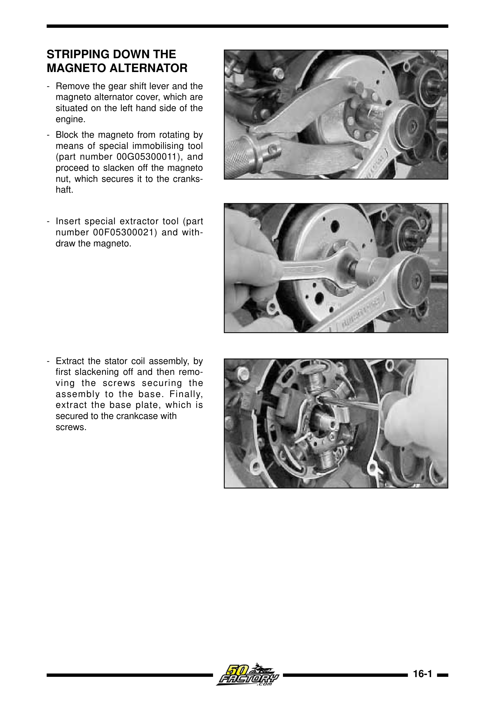
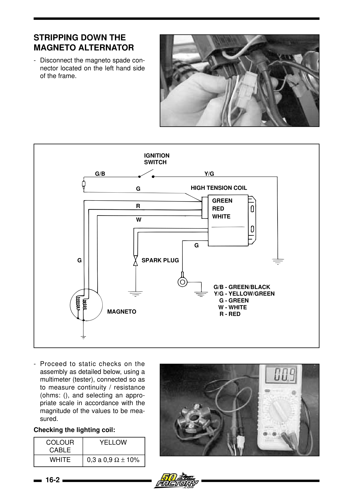
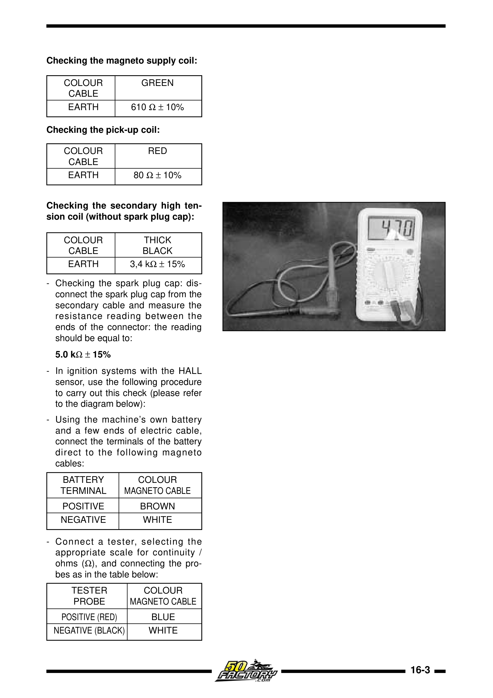
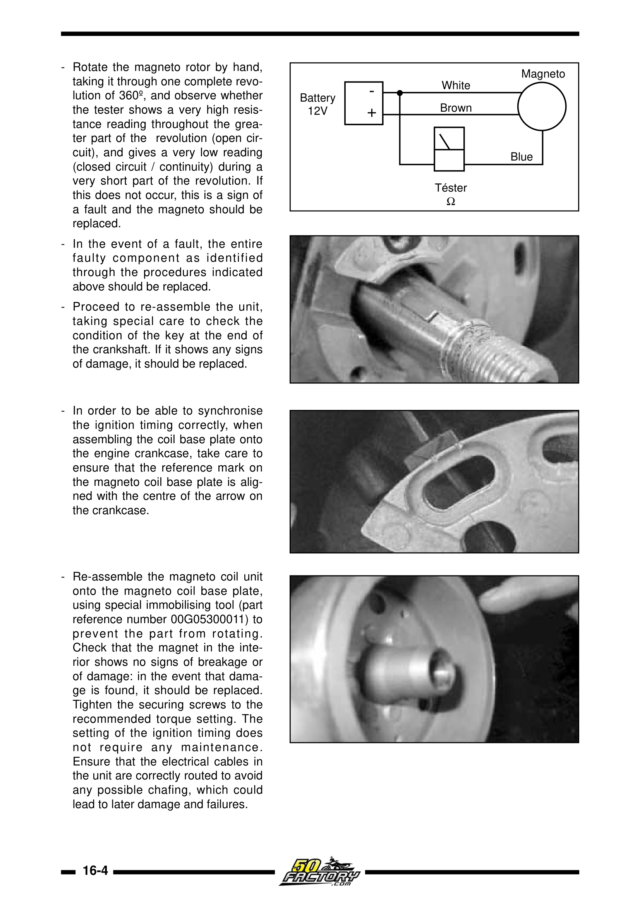

# Feilsøking: Ingen gnist

## Symptom
Motoren snurrer på kickstart, men tennpluggen gir ingen gnist. Kontroll: ta ut pluggen, koble til plugghetten, hold plugg-gjenger mot motorblokken, spark – observer gnist.

## Årsaker og løsninger

| Årsak | Diagnose | Løsning |
|-------|---------|---------|
| Stopptast kortslutter | Koble fra stopptasten, test gnist | Bytt bryter / reparer ledning |
| Defekt CDI-boks | Bytt med kjent god CDI | Bytt CDI (OEM: 8212474) |
| Brent ladespole (stator) | Mål grønn ledning → jord: skal gi 670–820 Ω | Bytt stator |
| Brent pick-up-spole | Mål rød ledning → jord: skal gi 80–140 Ω | Bytt stator |
| Defekt tennspole | Mål sekundærvikling: skal gi 3,4–5,0 kΩ | Bytt tennspole |
| Defekt plugghette | Mål: skal gi ~5 kΩ. 0 Ω eller ∞ = defekt | Bytt plugghette (NGK) |
| Korrodert kontakt / ledningsbrudd | Visuell inspeksjon, kontinuitetstest | Rens/reparer |

## Stator-diagnostikk (fra verkstedmanualen)

<figure markdown="span">
  { width="280" }
  { width="280" }
  <figcaption>Demontasje av magnetoalternator og sjekk av lysspolen. Kilde: Derbi Euro 2 Workshop Manual</figcaption>
</figure>

<figure markdown="span">
  { width="280" }
  { width="280" }
  <figcaption>Sjekk av ladespole/pick-up-spole (venstre) og Hall-sensor-test (høyre).</figcaption>
</figure>

## Diagnostikkflyt

```
1. Koble fra stopptast → test gnist
   ├── Gnist OK → Stopptast defekt
   └── Fortsatt ingen gnist →
       2. Mål stator ladespole (grønn → jord)
          ├── Feil verdi → Bytt stator
          └── OK →
              3. Mål pick-up-spole (rød → jord)
                 ├── Feil verdi → Bytt stator
                 └── OK →
                     4. Mål tennspole sekundær
                        ├── Feil verdi → Bytt tennspole
                        └── OK → Bytt CDI
```

## Se også

- [Feilsøking: Dør på gass / går dårlig](poor-running.md)
- [Koblingsskjema – Euro 2](../wiring/euro2.md)
- [Fargekodetabell](../wiring/color-codes.md)
- [Batteriladesystem – diagram](../images/workshop_manual/battery-charging-diagram.png)
