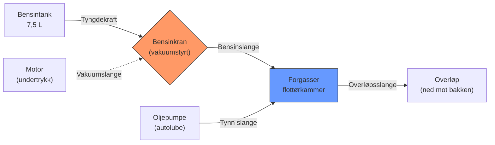
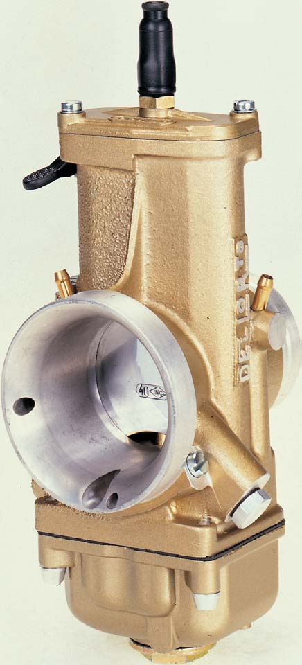

# Feilsøking: Starter ikke (gnist OK)

## Symptom
Motoren har gnist (verifisert), men vil ikke starte eller starter og dør umiddelbart.

## «Tre ting»-regelen
En motor trenger: **drivstoff, gnist, kompresjon.** Gnist er bekreftet – sjekk de to andre.

## Bensinsystem – flytdiagram



> Bensinkranen er vakuumstyrt – den åpner kun når motoren skaper undertrykk. Ingen undertrykk = ingen bensin = motor starter ikke.

{ width="450" }
*Oversikt over drivstoffleveringssystemet. Drivstoff mates fra tanken via bensinkranen til forgasserens flottørkammer. Kilde: Dell'Orto Tuning Manual*

## Årsaker og løsninger

| Årsak | Diagnose | Løsning |
|-------|---------|---------|
| Tom tank / stengt bensinkran | Visuelt sjekk | Fyll/åpne kran |
| Tilstoppet forgasser | Demonter bunnkar, inspiser dyser | Rens med forgasserrens spray + trykkluft |
| Oversvømt forgasser | Bensinlukt, våt plugg | Tøm bunnkaret, tørk plugg, vent 5 min |
| Feil chokebruk | – | Choke PÅ ved kaldstart, AV når varm |
| Lav kompresjon | Kompresjonstest: < 100 PSI = problem | Top-end rebuild (stempel + ringer) |
| Luftlekkasje (falsk luft) | Spray forgasserrens rundt pakninger med motor på tomgang – endring i turtall avslører lekkasje | Bytt pakninger / simringer |
| Slitt flottørnål | Forgasser lekker bensin | Bytt flottørnål |
| Gammel bensin (etter lagring) | Bensin > 3 mnd = problematisk | Tøm ut og fyll ferskt |
| Karbon-tilstoppet eksospotte | Motoren «kveles» | Brenn ut / bytt potte |

## Diagnostikkflyt

```
1. Er det bensin i tanken? Kran åpen?
   ├── Nei → Fyll/åpne
   └── Ja →
       2. Kommer bensin til forgasseren? (løsne bensinslange)
          ├── Nei → Kranfeil / tilstoppet slange
          └── Ja →
              3. Kjenn på tennpluggen
                 ├── Våt → Oversvømt. Tørk plugg, vent
                 └── Tørr →
                     4. Forgasser tilstoppet. Demonter og rens
                        └── Fortsatt problem →
                            5. Kompresjonstest
                               ├── < 100 PSI → Top-end rebuild
                               └── OK → Sjekk luftlekkasjer / reed-ventil
```

## Se også

- [Feilsøking: Dør på gass / går dårlig](poor-running.md)
- [Feilsøking: Overoppheting](overheating.md)
- [Forgasser – Dell'Orto PHVA](../carburetors/dellorto-phva.md)
