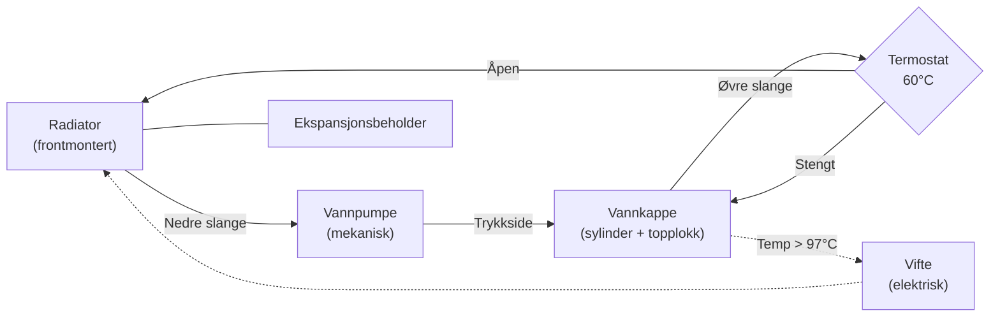
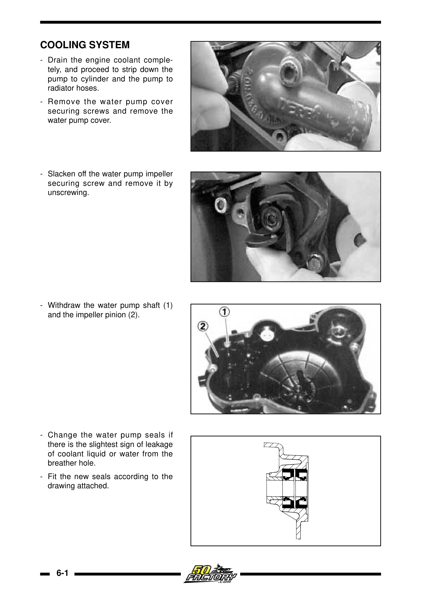
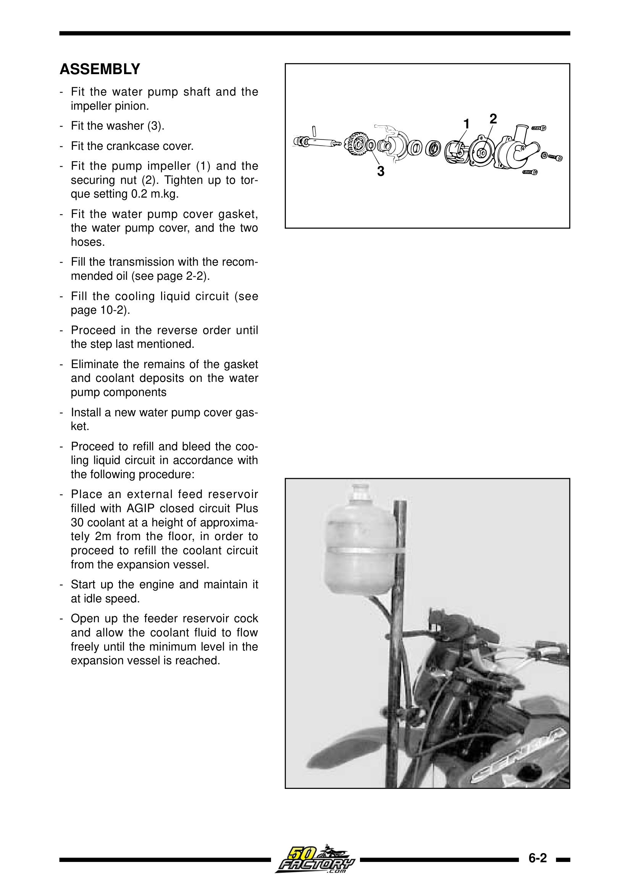

# Feilsøking: Overoppheting

## Symptom
Temperaturvarsel lyser, motor mister kraft, kjølevæske koker over, eller melkeaktig girolje.

## Kjølesystemet – oversikt

## Årsaker og løsninger

| Årsak | Diagnose | Løsning |
|-------|---------|---------|
| Termostat sitter fast (lukket) | Demonter og test i varmt vann (skal åpne ved 60°C) | Bytt termostat |
| Lavt kjølevæskenivå | Sjekk nivå i radiator + ekspansjonsbeholder | Etterfyll, sjekk lekkasje |
| Luftlomme i kjølesystemet | Vanlig etter alt kjølevæskearbeid | Luft med motor i gang, radiatorkorken av |
| Defekt vifte | Vifte skal slå inn ved ~97°C | Sjekk kontakt og termobryter |
| Tilstoppet radiator | Visuell: insekter, skitt, bøyde lameller | Rens med forsiktig vannstråle (ikke høytrykksspyler) |
| Vannpumpe-svikt | Sjekk impeller / weep hole drypper | Bytt vannpumpesett (aksel + impeller + simringer) |
| Blåst topplokk-pakning | Hvit røyk, kjølevæske i girolje (melkeaktig «mayo») | Bytt toppakning, sjekk topplokk planhet (maks 0,05 mm) |

## Vannpumpe-reparasjon (simringer)

<figure markdown="span">
  { width="280" }
  { width="280" }
  <figcaption>Vannpumpe demontasje (venstre) og tetningssett-montering (høyre). Kilde: Derbi Euro 2 Workshop Manual</figcaption>
</figure>

Et «weep hole» i vannpumpehuset varsler om ytre simringsvikt. De to simringene (10×24×6 mm) monteres **asymmetrisk**:

1. Indre simring bankes inn **forbi drenshullet** (forsegler girolje-siden)
2. Ytre simring presses inn til den ligger **eksakt plant** – IKKE lenger (blokkerer drenshullet ellers)

> ⚠️ Frostvæske i girolje skaper «mayo»-emulsjon som umiddelbart ødelegger lagre og klutsjlameller. Tøm og bytt girolje straks.

## Termostatdata

| Parameter | Verdi |
|-----------|-------|
| Termostat åpner | 60°C ±2°C |
| Full vandring | 3,5–5 mm ved 70°C |
| Vifte aktiverer | 97°C ±3°C |
| Vifte deaktiverer | 85°C |
| Overopphetings-varsel | 124°C ±3°C |

## Se også

- [Motor – EBS050](../engines/ebs050.md)
- [Væskeoversikt](../maintenance/fluids.md)
