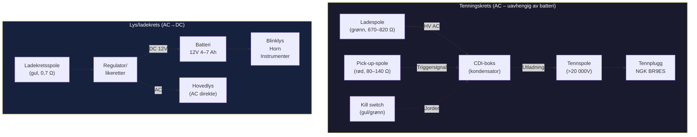
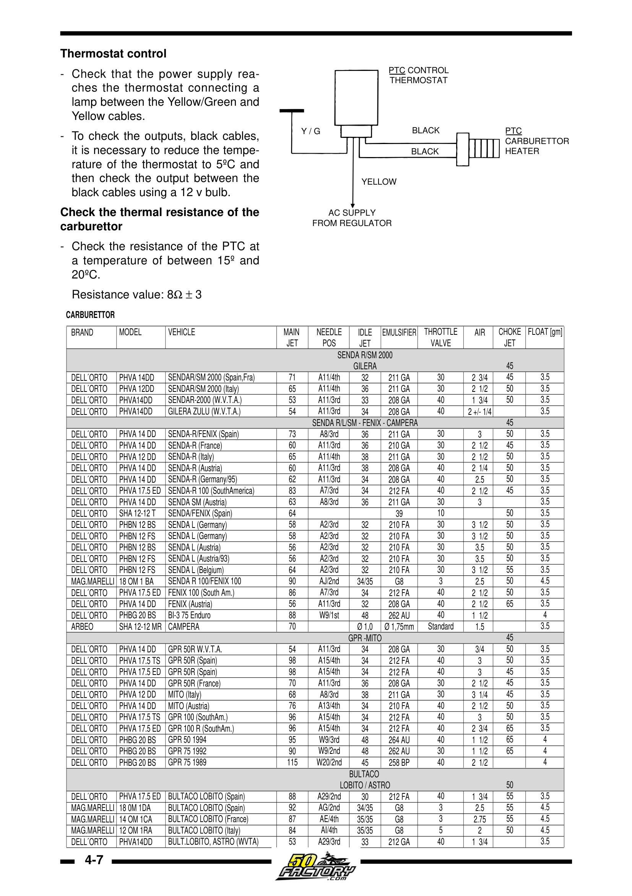
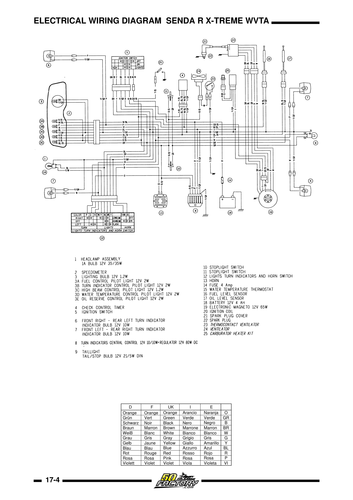
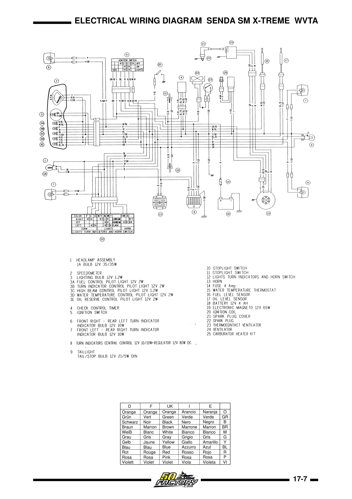
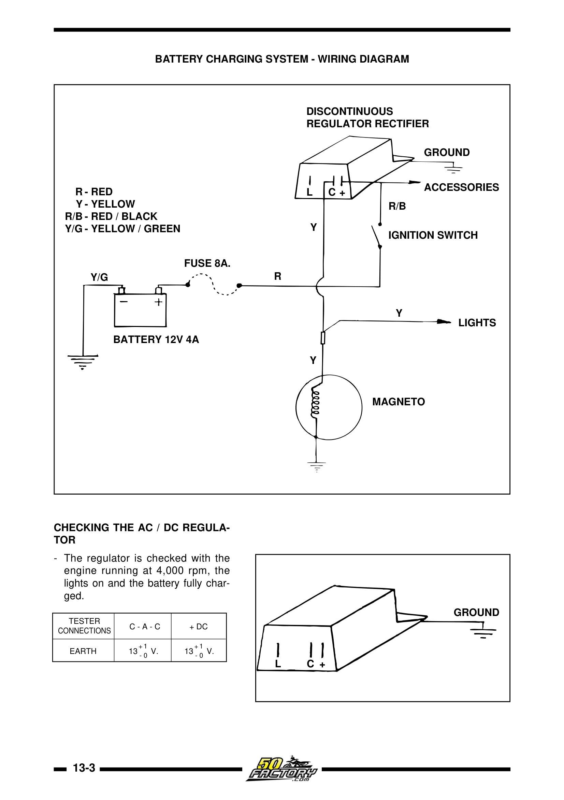
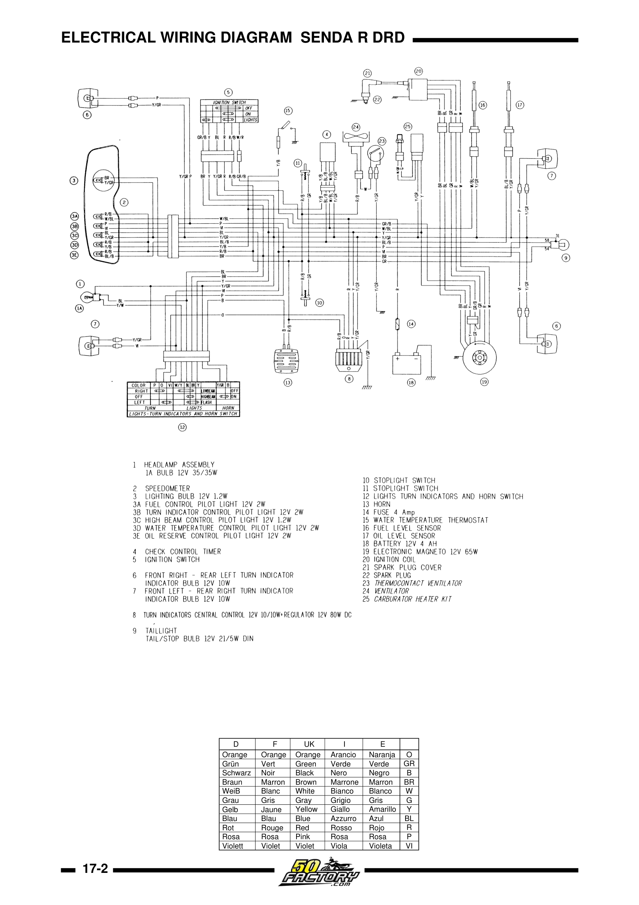
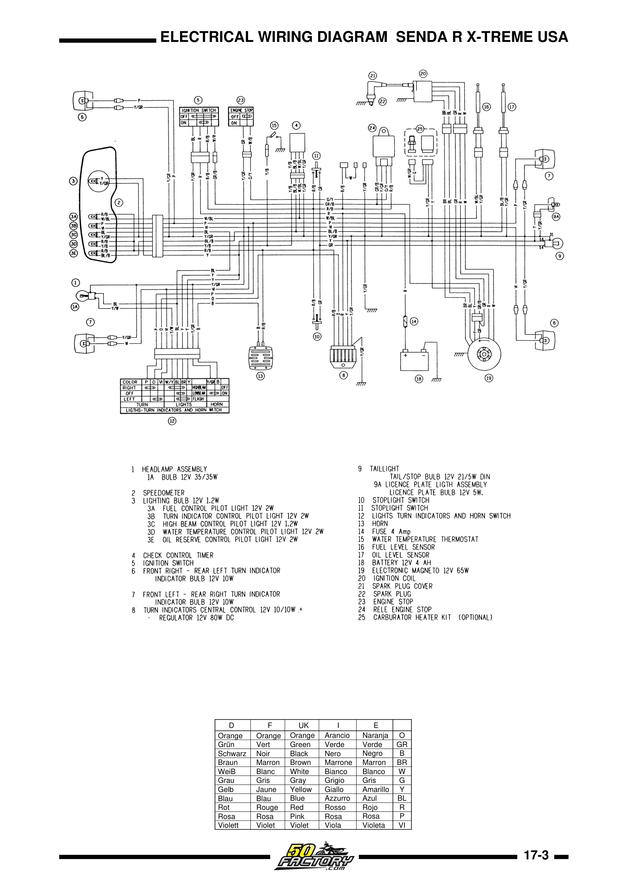
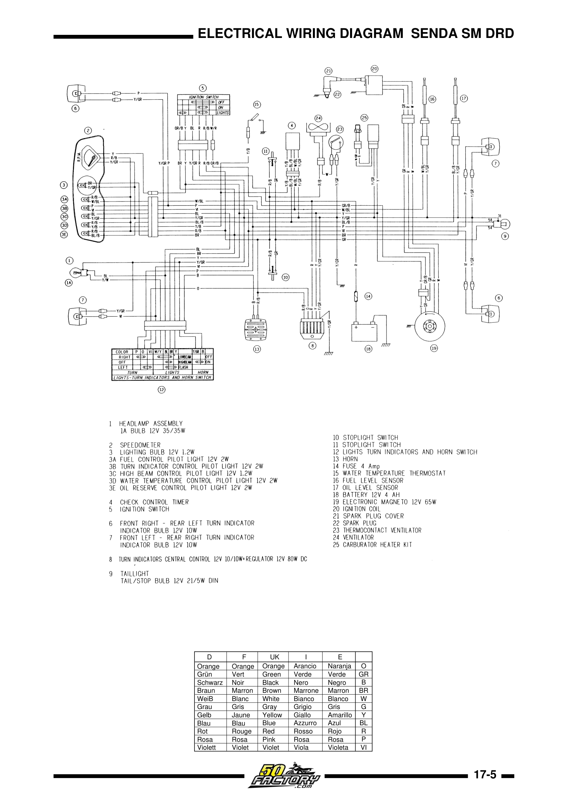
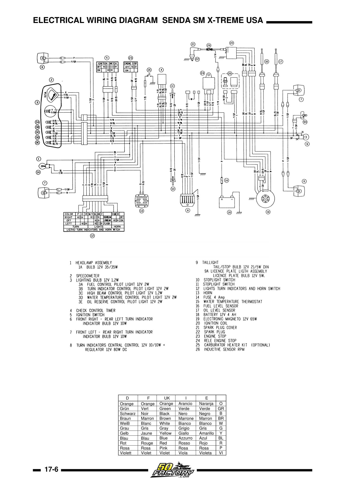

# Koblingsskjema – Euro 2 (EBS/EBE 2000–2005)

## Todelt arkitektur

Det elektriske systemet på EBS/EBE-motoren er todelt:
- **Tenningskrets (CDI)** – totalt uavhengig av resten; motoren starter og går selv uten batteri
- **Lys/ladekrets** – mater lys og lader batteri via regulator/likeretter

Hovedlykten drives typisk av **vekselstrøm (AC)** direkte fra statoren via regulatoren, mens blinklys, horn og instrumentbelysning drives av **likestrøm (DC)** fra batteriet.

## Nøkkelkomponenter

| Komponent | Spesifikasjon |
|-----------|--------------|
| Stator | 6-spolers magnetoalternator |
| Generator | 12V / 65W (noen modeller 85W/120W) |
| CDI-enhet | AC CDI, 4-pin Ducati/Kokusan |
| CDI OEM-nr. | 8212474 / 11.20632 800 / 00H03330171 |
| Batteri | 12V / 4–7 Ah SLA |
| Hovedsikring | 4A |
| Tennplugg | NGK BR8ES / BR9ES (14 mm gjenge, 19 mm gjengelengde) |
| Elektrodegap | 0,6 mm |

## AC CDI – slik fungerer det

Den sjette statorspolen (forseglet i hvitt epoksy) produserer høyspent vekselstrøm som lader kondensatoren i CDI-boksen. Når pick-up-spolen registrerer at svinghjulets metallflik passerer, åpner en SCR (Silicon Controlled Rectifier) som dumper energien til tennspolen. Tennspolen mangedobler spenningen til over 20 000V.

Maskinen stanses ved at tenningslås/dødmannsknapp jorder CDI-ens høyspenningskabel.

> **Viktig:** Systemet er totalt uavhengig av batteri og regulator. Motoren starter og går uten disse.

## Signalvei

> De to kretsene er totalt uavhengige. Motoren starter og går uten batteri, regulator eller lys.

## Stator-diagnostikk (multimeter)

{ width="450" }
*Termostat PTC-kontroll og forgasservarmer-sjekk. Kilde: Derbi Euro 2 Workshop Manual, s. 32*

| Kretskomponent | Ledningsfarge | Måles mot | Normal motstand |
|----------------|---------------|-----------|-----------------|
| Høyspennings ladespole (CDI) | Grønn | Jord | 670–820 Ω (±10%) |
| Pick-up / trigger-spole | Rød | Jord | 80–140 Ω (±10%) |
| AC/DC ladekrets (lys/batteri) | Gul | Jord | 0,7 Ω (±10%) |
| Hovedjording / kill-switch | Gul/grønn eller hvit | Chassis | Kontinuitet (0 Ω) |
| Sekundær høyspenningscoil | Pluggkabel | Tennplugghette | 3,4–5,0 kΩ (±15%) |
| Støydempet tennplugghette | Hetten i seg selv | Gjennomgang | 5 kΩ (±15%) |

Avvik fra disse verdiene: ∞ = ledningsbrudd, ~0 Ω = kortslutning.

> ⚠️ Verdiene varierer noe mellom modeller. Se modellspesifikke sider for eksakte verdier.

## Spenningsregulator – Servicebulletin PV 05-10

Derbi utstedte oppdatering som erstattet original regulator:
- **Original:** delenr. 00H01004841 (lys blå kontakt)
- **Oppdatert:** delenr. 864660 (gul kontakt)

> ⚠️ Feil wattasje på frontlyspære kan blåse statoren.

## Offisielle koblingsskjemaer

### Koblingsskjemaer fra verkstedmanualen (uthentet fra PDF)

<figure markdown="span">
  { width="500" }
  <figcaption>Koblingsskjema – Senda R X-Treme WVTA. Kilde: Derbi Euro 2 Workshop Manual, s. 72</figcaption>
</figure>

<figure markdown="span">
  { width="500" }
  <figcaption>Koblingsskjema – Senda SM X-Treme WVTA. Kilde: Derbi Euro 2 Workshop Manual, s. 75</figcaption>
</figure>

<figure markdown="span">
  { width="500" }
  <figcaption>Batteriladesystem – diagram med regulator/likeretter. Kilde: Derbi Euro 2 Workshop Manual, s. 62</figcaption>
</figure>

??? note "Alle modellvarianter"
    | Modell | Bilde |
    |--------|-------|
    | Senda R DRD | { width="400" } |
    | Senda R X-Treme USA | { width="400" } |
    | Senda SM DRD | { width="400" } |
    | Senda SM X-Treme USA | { width="400" } |

### Eksterne lenker

| Kilde | Lenke |
|-------|-------|
| Euro 2 Workshop Manual – SM X-Treme koblingsskjema (s. 72) | https://www.manualslib.com/manual/1619038/Nacional-Motor-Derbi-Euro-2.html?page=72 |
| Euro 2 Workshop Manual – Batterilading og regulator (s. 59) | https://www.manualslib.com/manual/1619038/Nacional-Motor-Derbi-Euro-2.html?page=59 |
| 50factory.com visuell ledningsguide med bilder | https://en.50factory.com/content/244-changing-his-electric-beam-on-derbi-senda-and-gilera-smt-RCR |
| Piaggio Wiring Diagrams (Scribd) | https://www.scribd.com/document/405921252/H-K-GSM-Charging-Ignition-pdf |
| CDI og stator forklaring (Scribd) | https://www.scribd.com/document/463428224/Help-electrical-explained-pdf |

---

## OEM eksploderte diagrammer – elektrisk

Interaktive diagrammer med delenumre (ekstern, copyright OEM):

| System | Modell | Lenke |
|--------|--------|-------|
| Elektrisk system (komplett) | R X-Race E2 2004 | [motorcyclespareparts.eu](https://www.motorcyclespareparts.eu/en/derbi-parts/2004-senda-50-r-x-race-e2-motorcycles/electrical-system) |
| CDI / magneto | SM X-Race 50 E2 | [oemmotorparts.com](https://www.oemmotorparts.com/en/model/derbi/senda-50-sm-x-race-50-cc-euro2/2004/drawing/cdi-magneto-assy) |
| Electrical System | SM X-Race 50 E2 | [oemmotorparts.com](https://www.oemmotorparts.com/en/model/derbi/senda-50-sm-x-race-50-cc-euro2/2004/drawing/electrical-system) |
| Ledningsnett (wiring harness) | SM Euro2 125cc | [oemmotorparts.com](https://www.oemmotorparts.com/en/model/derbi/senda-sm-euro2-125-cc/2004/drawing/wiring-harness) |

---

## Modellspesifikke elektriske detaljer

- [Senda R 2004 – Elektrisk system](../models/senda-r-2004/README.md#9-elektrisk-system)
- [Senda SM X-Trem 2005 – Elektrisk system](../models/senda-sm-xtrem-2005/README.md#9-elektrisk-system-og-cdi-diagnostikk)
